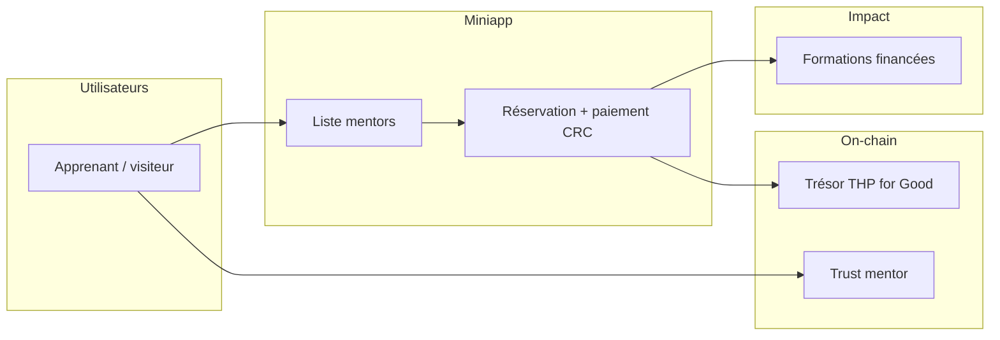

# 01 — Présentation

## Qu’est-ce que THP for Good ?

**THP for Good** est un fonds communautaire créé pour favoriser le code au service de l’intérêt général. Il finance des parcours de formation (bootcamp Développeur++, diplôme RNCP) pour des personnes porteuses de projets open source à impact social, sélectionnées par la communauté THP.

Ce dépôt héberge la **mini-application Circles** du même nom : une place de marché de mentorat où chacun peut réserver un appel avec un mentor expert, en payant en **CRC** (Circles Regeneration Currency). Les revenus alimentent le trésor du groupe Circles THP for Good et financent de nouvelles places en formation.

## Proposition de valeur

| Acteur | Bénéfice |
|--------|----------|
| **Mentoré** | Accès rapide à un expert (IA, legal, design, photo, dev…) sans barrière bancaire classique — paiement en monnaie Circles |
| **Mentor** | Visibilité, renforcement du graphe de confiance Circles via TRUST post-appel |
| **Fonds THP for Good** | Flux de revenus on-chain récurrents pour financer des bourses |
| **Écosystème Circles** | Cas d’usage concret : Safe hôte, transferts CRC, profils avatar |

## Fonctionnalités (branche courante `ToXY`)

| Fonctionnalité | Statut | Description |
|----------------|--------|-------------|
| Catalogue mentors | ✅ | Quatre mentors seed (Zet, Flo, Dimitry, Vincent) + filtres par domaine |
| Profils Circles | ✅ | Avatar, bio, stats trust via RPC `getProfileView` (cache serveur 5 min) |
| Créneaux | ✅ | Grille sur 5 jours ouvrés (10h / 14h), générée côté client |
| Connexion wallet | ✅ | Injection par l’hôte Circles (`onWalletChange`) — pas de bouton « Connect » |
| Login (signature) | ✅ | `signMessage` EIP-1271 avant paiement ou trust |
| Paiement 100 CRC | ✅ | Vers fondation THP ; résolution automatique groupe → trésor |
| Historique appels | ✅ | `localStorage` par adresse wallet |
| Trust mentor | ✅ | `avatar.trust.add` après réservation |
| Inscription mentor | 🔜 | Prévu branche `zet` (formulaire + SQLite) |
| Admin | 🔜 | Prévu branche `zet` (whitelist organisateurs) |

## Maquette produit

Wireframe cible du parcours (hackathon) :

*Source : `spec/mockup.png` sur la branche `zet`.*

## Où utiliser l’application ?

1. **Développement local** — `pnpm dev` → http://localhost:3000 (wallet déconnecté : normal hors iframe).
2. **Playground Circles** — https://circles.gnosis.io/playground?url=<votre-url-https>
3. **Production** — déploiement Coolify / Vercel (voir [04 — Guide développeur](./04-guide-developpeur.md))

L’application est conçue pour tourner **dans l’iframe** du host Circles : le Safe de l’utilisateur est injecté ; les transactions passent par `sendTransactions`.

## Liens utiles

- [Circles — Embedded miniapps](https://docs.aboutcircles.com/miniapps/embedded-mini-apps)
- [Playground Circles](https://circles.gnosis.io/playground)
- [RPC Circles (indexer)](https://rpc.aboutcircles.com/)
- Groupe THP on-chain : `0x2b5E4045936ef12250a8c01e4Cbf71E9bEE69e00`
