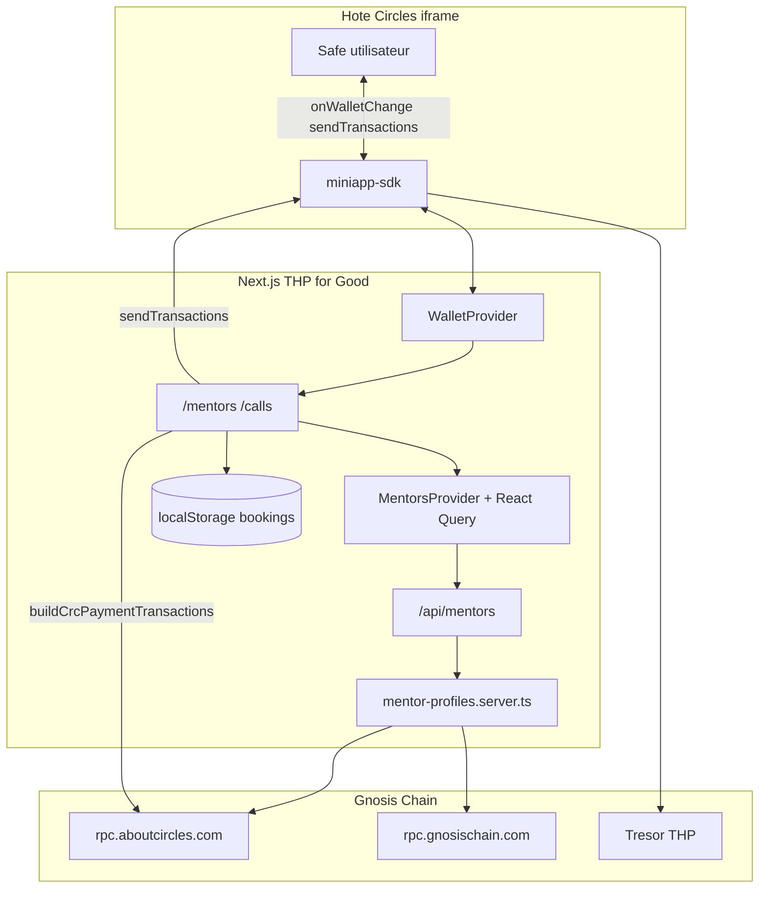
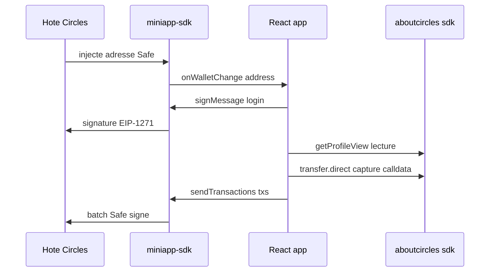
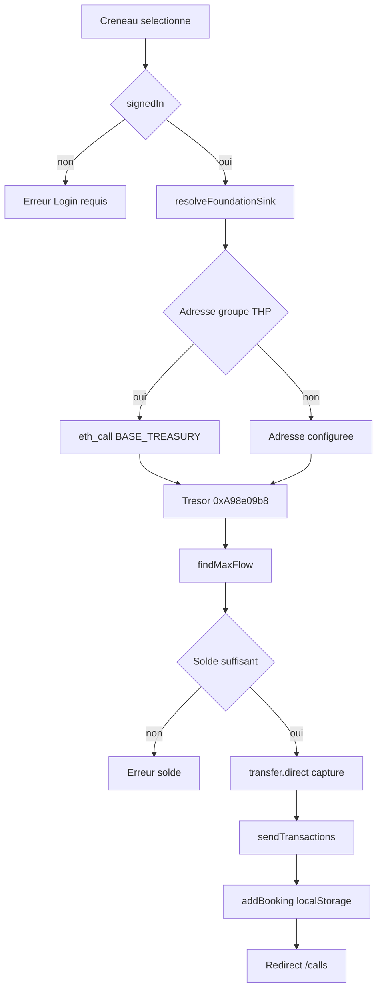
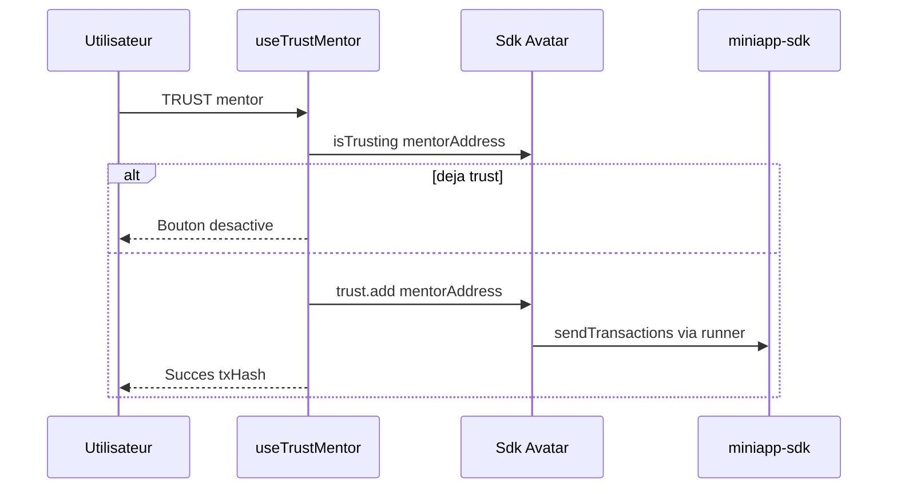
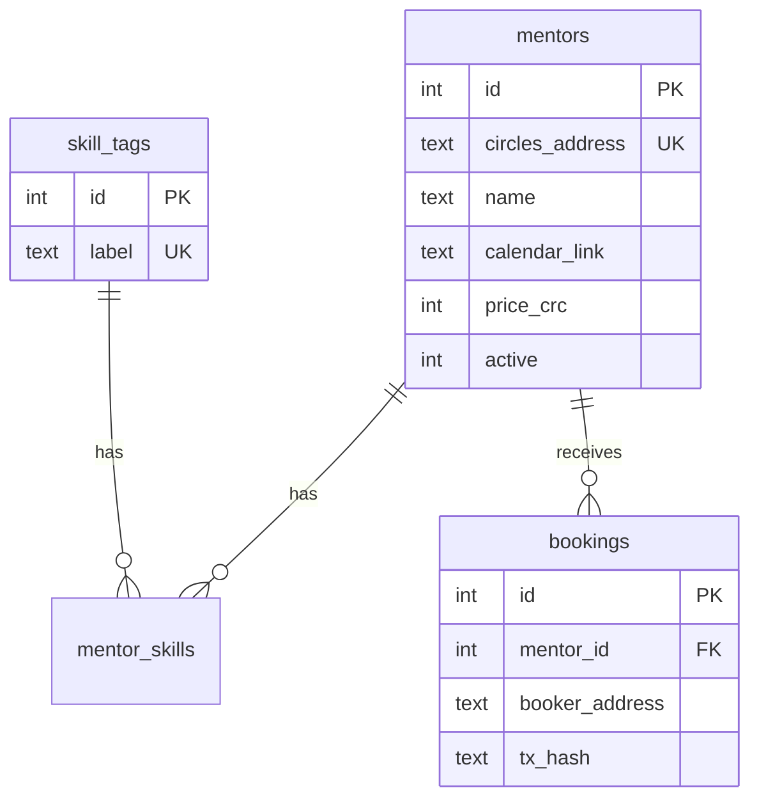

# Architecture technique

[← Présentation](./01-presentation.md) · [Documentation](./README.md) · [Guide utilisateur →](./03-guide-utilisateur.md)

## Table des matières

- [Stack](#stack)
- [Vue d’ensemble](#vue-densemble)
- [Intégration Circles](#intégration-circles--règles-critiques)
- [Flux de paiement CRC](#flux-de-paiement-crc-100-crc)
- [Flux Trust](#flux-trust-post-appel)
- [Routes](#routes-applicatives)
- [Sécurité iframe](#sécurité--iframe)
- [Évolutions branche zet](#évolutions-architecture-branche-zet)

---

## Stack

| Couche | Technologie | Rôle |
|--------|-------------|------|
| Framework | **Next.js 16** (App Router, Turbopack) | Pages, API routes, SSR/cache |
| UI | **React 19**, **Tailwind v4**, **shadcn/ui** (Base UI) | Interface mobile-first (`max-w-md`) |
| État client | **TanStack Query** | Liste mentors via `/api/mentors` |
| Blockchain read | `@aboutcircles/sdk` | Profils, pathfinder, `transfer.direct` |
| Blockchain write (hôte) | `@aboutcircles/miniapp-sdk` | Wallet, `signMessage`, `sendTransactions` |
| Encodage tx | **viem** (transitif) | Runner miniapp, receipts Gnosis |
| Persistance réservations | `localStorage` | Historique par wallet (MVP `ToXY`) |
| Persistance mentors (futur) | **SQLite** (`better-sqlite3`) | Branche `zet` |
| Déploiement | **Coolify** (Nixpacks + pnpm) | `nixpacks.toml`, CSP iframe |

## Vue d’ensemble



## Intégration Circles — règles critiques

### Deux SDK, deux rôles



| SDK | Usage dans THP for Good |
|-----|-------------------------|
| `miniapp-sdk` | Composants client uniquement + import dynamique : wallet, signature, envoi tx |
| `@aboutcircles/sdk` | Lecture profils (`getProfileView`), pathfinder, construction transfert CRC |

> [!WARNING]
> Ne **jamais** importer ces SDK au top-level d’un Server Component — erreur `window is not defined` au build.

### Lecture profil vs écriture

| Opération | API recommandée |
|-----------|-----------------|
| Lecture profil / balance | `sdk.rpc.profile.getProfileView(address)` |
| Trust / transfert CRC | `sdk.getAvatar(address)` + `ContractRunner` custom (capture txs) |

## Flux de paiement CRC (100 CRC)



### Fichiers clés

| Fichier | Responsabilité |
|---------|----------------|
| [`lib/config.ts`](../lib/config.ts) | Adresses groupe/trésor, prix CRC |
| [`lib/foundation-sink.ts`](../lib/foundation-sink.ts) | Résolution groupe → trésor |
| [`lib/crc-transfer.ts`](../lib/crc-transfer.ts) | Pathfinder, capture → format miniapp |
| [`hooks/use-book-call.ts`](../hooks/use-book-call.ts) | Orchestration login + paiement |
| [`components/mentors/BookCallButton.tsx`](../components/mentors/BookCallButton.tsx) | UI PAY + feedback |

> [!NOTE]
> **Pourquoi le trésor ?** Le pathfinder Circles refuse les avatars « groupe » comme destinataire. L’adresse du groupe THP (`0x2b5E…`) est résolue vers son **BASE_TREASURY** avant transfert.

## Flux Trust post-appel



## Routes applicatives

| Route | Type | Description |
|-------|------|-------------|
| `/` | Server | Dashboard boilerplate |
| `/mentors` | Client | Liste + filtre domaine |
| `/mentors/[slug]` | Client | Fiche mentor, créneaux, paiement |
| `/calls` | Client | Historique + bouton Trust |
| `/profile` | Server | Démo lookup Circles |
| `/actions` | Server | Démo `sendTransactions` |
| `/api/mentors` | API GET | Mentors enrichis (revalidate 300s) |

Navigation : [`lib/nav.ts`](../lib/nav.ts).

## Sécurité & iframe

Entête définie dans [`next.config.ts`](../next.config.ts) :

```http
Content-Security-Policy: frame-ancestors 'self' https://*.gnosis.io https://*.gnosis.box https://*.vercel.app;
```

> [!WARNING]
> Sans `frame-ancestors`, le host Circles ne peut pas embarquer l’application.

## Évolutions architecture (branche `zet`)



Schéma SQL complet et routes API : [`spec/PRD.md`](./spec/PRD.md).

---

[← Présentation](./01-presentation.md) · [Guide utilisateur →](./03-guide-utilisateur.md)
