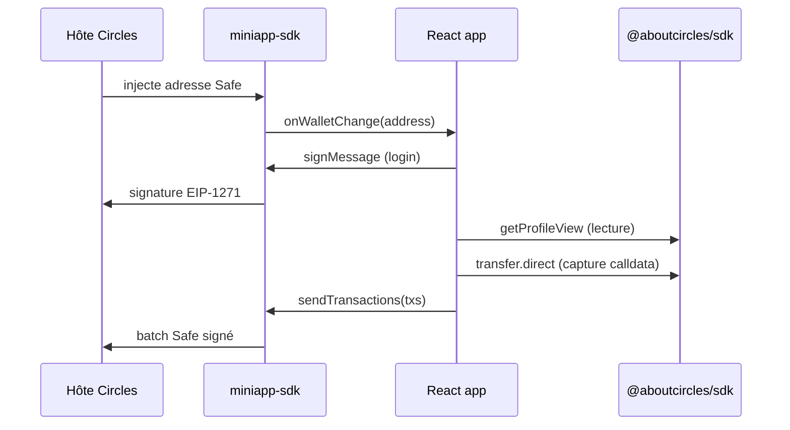
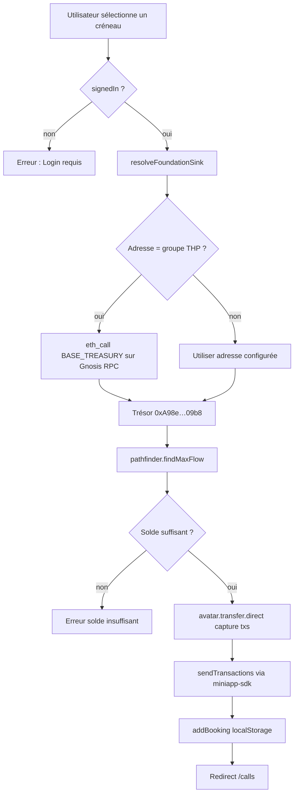
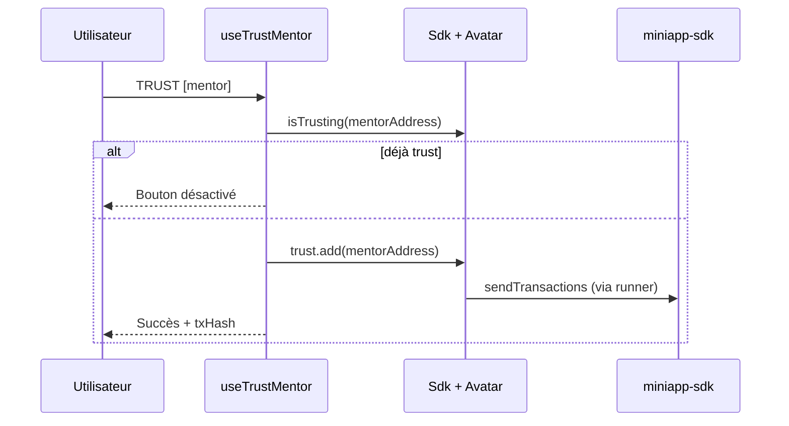
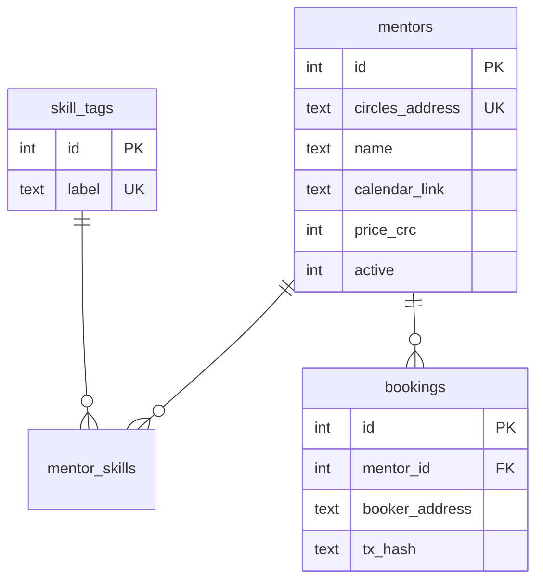

# 02 — Architecture technique

## Stack

| Couche | Technologie | Rôle |
|--------|-------------|------|
| Framework | **Next.js 16** (App Router, Turbopack) | Pages, API routes, SSR/cache |
| UI | **React 19**, **Tailwind v4**, **shadcn/ui** (Base UI) | Interface mobile-first (`max-w-md`) |
| État client | **TanStack Query** | Liste mentors via `/api/mentors` |
| Blockchain read | **`@aboutcircles/sdk`** | Profils, pathfinder, `transfer.direct` |
| Blockchain write (hôte) | **`@aboutcircles/miniapp-sdk`** | Wallet, `signMessage`, `sendTransactions` |
| Encodage tx | **viem** (transitif) | Runner miniapp, receipts Gnosis |
| Persistance réservations | **`localStorage`** | Historique par wallet (MVP `ToXY`) |
| Persistance mentors (futur) | **SQLite** (`better-sqlite3`) | Branche `zet` |
| Déploiement | **Coolify** (Nixpacks + pnpm) | `nixpacks.toml`, CSP iframe |

## Vue d’ensemble

```mermaid
flowchart TB
  subgraph Host["Hôte Circles (iframe)"]
    SAFE[Safe utilisateur]
    SDK_M[@aboutcircles/miniapp-sdk]
  end

  subgraph Next["Next.js — THP for Good"]
    WP[WalletProvider]
    MP[MentorsProvider + React Query]
    API["/api/mentors"]
    ENR[mentor-profiles.server.ts]
    PAGES["/mentors · /mentors/[slug] · /calls"]
    LS[(localStorage bookings)]
  end

  subgraph Gnosis["Gnosis Chain"]
    RPC_C[rpc.aboutcircles.com]
    RPC_G[rpc.gnosischain.com]
    TREASURY[Trésor THP]
  end

  SAFE <-->|onWalletChange · sendTransactions| SDK_M
  SDK_M <--> WP
  WP --> PAGES
  PAGES --> MP
  MP --> API
  API --> ENR
  ENR --> RPC_C
  PAGES -->|buildCrcPaymentTransactions| RPC_C
  PAGES -->|sendTransactions| SDK_M
  SDK_M --> TREASURY
  PAGES --> LS
  ENR --> RPC_G
```

## Intégration Circles — règles critiques

### Deux SDK, deux rôles



| SDK | Usage dans THP for Good |
|-----|-------------------------|
| `miniapp-sdk` | **Uniquement** dans composants client + import dynamique : wallet, signature, envoi tx |
| `@aboutcircles/sdk` | Lecture profils (`getProfileView`), pathfinder, construction transfert CRC |

**Ne jamais** importer ces SDK au top-level d’un Server Component — erreur `window is not defined` au build.

### Lecture profil vs écriture

- **Lecture** : `sdk.rpc.profile.getProfileView(address)` — dégrade gracieusement si l’adresse n’est pas avatar Circles.
- **Écriture trust / transfert** : `sdk.getAvatar(address)` avec `ContractRunner` custom qui capture les transactions au lieu de les envoyer.

## Flux de paiement CRC (100 CRC)



Fichiers clés :

| Fichier | Responsabilité |
|---------|----------------|
| `lib/config.ts` | Adresses groupe/trésor, prix CRC |
| `lib/foundation-sink.ts` | Résolution groupe → trésor (`tokenType` + `eth_call`) |
| `lib/crc-transfer.ts` | Pathfinder, `transfer.direct`, capture → format miniapp |
| `hooks/use-book-call.ts` | Orchestration login + paiement + stockage |
| `components/mentors/BookCallButton.tsx` | UI PAY + feedback |

> **Pourquoi le trésor ?** Le pathfinder Circles refuse les avatars « groupe » comme destinataire direct. L’adresse publique du groupe THP (`0x2b5E…`) est donc résolue vers son **BASE_TREASURY** avant transfert.

## Flux Trust post-appel



## Routes applicatives

| Route | Type | Description |
|-------|------|-------------|
| `/` | Server | Dashboard boilerplate (connexion, sign-in démo) |
| `/mentors` | Client | Liste + filtre domaine |
| `/mentors/[slug]` | Client | Fiche mentor, créneaux, paiement |
| `/calls` | Client | Historique + bouton Trust |
| `/profile` | Server | Démo lookup Circles (boilerplate) |
| `/actions` | Server | Démo `sendTransactions` (boilerplate) |
| `/api/mentors` | API GET | Mentors enrichis Circles (revalidate 300s) |

Navigation centralisée dans `lib/nav.ts`.

## Sécurité & iframe

`next.config.ts` définit :

```
Content-Security-Policy: frame-ancestors 'self' https://*.gnosis.io https://*.gnosis.box https://*.vercel.app;
```

Sans cette entête, le host Circles ne peut pas embarquer l’app.

## Évolutions architecture (branche `zet`)



Voir [spec/PRD.md](./spec/PRD.md) pour le schéma SQL complet et les routes API prévues.
