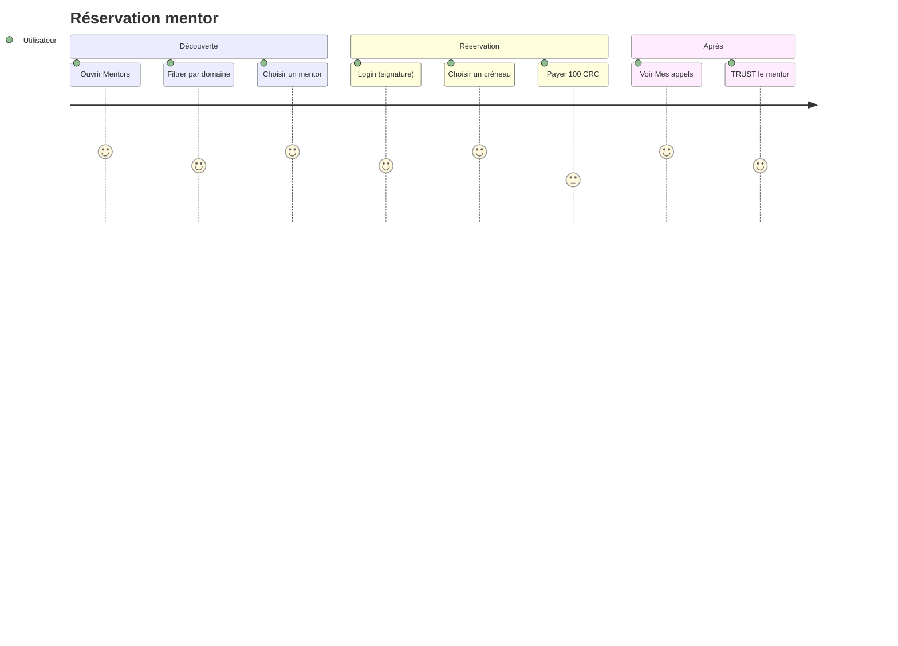

# 03 — Guide utilisateur

Ce guide décrit l’usage de **THP for Good** dans le host Circles (playground ou production). Hors iframe, la connexion wallet et les paiements ne fonctionnent pas — c’est le comportement attendu.

## Prérequis

| Prérequis | Détail |
|-----------|--------|
| Compte Circles | Safe accessible dans le host |
| CRC | ~100 CRC disponibles (non wrappés de préférence — voir message d’erreur pathfinder) |
| Navigateur | URL HTTPS de l’app (Vercel, Coolify, etc.) |
| Host | [circles.gnosis.io/playground](https://circles.gnosis.io/playground) |

## Parcours : réserver un appel

### Étape 1 — Ouvrir l’app dans Circles

1. Déployez ou utilisez l’URL de l’app.
2. Collez l’URL dans le playground : `https://circles.gnosis.io/playground?url=<votre-app>`
3. Le badge en-tête affiche une adresse raccourcie (Safe connecté).

### Étape 2 — Parcourir les mentors

Menu **Mentors** :

- Texte d’accroche : *Get a call with a mentor, Pay in CRC, help someone get a free bootcamp tuition.*
- Champ **Which domain you want be helped with** — ex. `AI`, `Legal`, `Dev` (séparateurs `;` ou `,`).
- Grille de cartes : photo Circles si l’adresse mentor est configurée, nom, tags.

### Étape 3 — Fiche mentor

1. Cliquez sur un mentor.
2. Lisez la bio et les statistiques trust (si profil Circles chargé).
3. **Sélectionnez un créneau** dans la grille (jours ouvrés, 10h ou 14h).
4. Cliquez sur **Login** si le bandeau l’indique — signez le message dans le host.
5. Appuyez sur **PAY 100 CRC to THP for Good**.
6. Confirmez la transaction dans le host Circles.
7. Redirection automatique vers **Mes appels** après succès.

### Écran récapitulatif (wireframe)

## Parcours : Mes appels & Trust

Menu **Mes appels** :

| Élément | Description |
|---------|-------------|
| Liste | Chaque réservation : mentor, tags, créneau, date |
| TRUST | Endosse le mentor sur le graphe Circles (nécessite Login + avatar Circles) |
| Vide | Lien vers Mentors si aucune réservation |

Le trust renforce la réputation du mentor dans l’économie Circles ; il est distinct du paiement (qui va au fonds, pas au mentor individuellement).

## Messages d’erreur courants

| Message (FR) | Cause probable | Action |
|--------------|----------------|--------|
| Ouvrez dans l'hôte Circles | App ouverte en onglet seul | Utiliser le playground |
| Connectez-vous via Login | Session signature absente | Bouton Login sur la fiche mentor |
| Solde CRC insuffisant | Pathfinder < 100 CRC | Déwrapper CRC dans Circles, vérifier trust vers trésor |
| Transaction annulée | Refus dans le host | Réessayer |
| Adresse fondation non configurée | `.env` manquant côté déploiement | Contacter l’équipe technique |

## Tarification

- **Montant par défaut** : 100 CRC (variable `NEXT_PUBLIC_BOOKING_PRICE_CRC`).
- **Bénéficiaire** : trésor du groupe THP for Good (pas le mentor directement).
- Les mentors sont rémunérés hors app (modèle hackathon) ; l’app collecte pour le **fonds formation**.

## FAQ

**Puis-je réserver sans compte Circles ?**  
Non — le wallet est injecté par le host ; sans Safe connecté, le bouton de paiement reste inactif.

**Les créneaux sont-ils synchronisés avec Google Calendar ?**  
Sur la branche `ToXY`, les créneaux sont **indicatifs** (génération locale). La branche `zet` prévoit l’ouverture d’un lien calendrier mentor après paiement.

**Où sont stockées mes réservations ?**  
Dans le navigateur (`localStorage`), clé par adresse wallet. Effacer les données du site supprime l’historique.

**Le paiement va-t-il au mentor ?**  
Non — il alimente le fonds THP for Good (trésor du groupe Circles).
