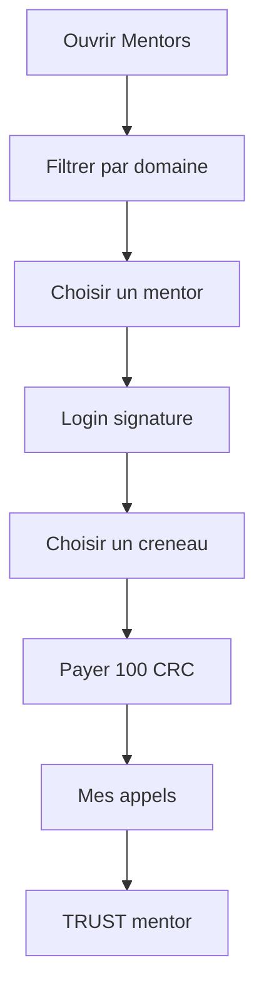
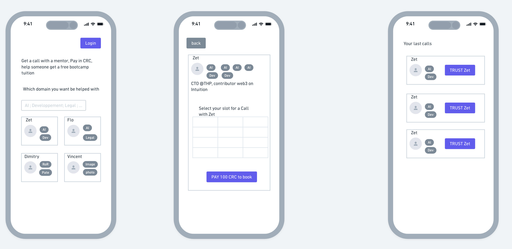

# Guide utilisateur

[← Architecture](./02-architecture.md) · [Documentation](./README.md) · [Guide développeur →](./04-guide-developpeur.md)

## Table des matières

- [Prérequis](#prérequis)
- [Réserver un appel](#parcours--réserver-un-appel)
- [Mes appels et Trust](#parcours--mes-appels--trust)
- [Messages d’erreur](#messages-derreur-courants)
- [Tarification](#tarification)
- [FAQ](#faq)

---

Ce guide décrit l’usage de **THP for Good** dans le host Circles (playground ou production).

> [!IMPORTANT]
> Hors iframe Circles, la connexion wallet et les paiements **ne fonctionnent pas**. C’est le comportement attendu.

## Prérequis

| Prérequis | Détail |
|-----------|--------|
| Compte Circles | Safe accessible dans le host |
| CRC | ~100 CRC disponibles (de préférence non wrappés) |
| Navigateur | URL **HTTPS** de l’app (Vercel, Coolify, etc.) |
| Host | [circles.gnosis.io/playground](https://circles.gnosis.io/playground) |

## Parcours : réserver un appel



### Étape 1 — Ouvrir l’app dans Circles

1. Déployez ou utilisez l’URL HTTPS de l’application.
2. Ouvrez le playground avec votre URL :
   ```
   https://circles.gnosis.io/playground?url=<votre-app>
   ```
3. Le badge en-tête affiche une adresse raccourcie (Safe connecté).

### Étape 2 — Parcourir les mentors

Menu **Mentors** :

- Accroche : *Get a call with a mentor, Pay in CRC, help someone get a free bootcamp tuition.*
- Champ **Which domain you want be helped with** — ex. `AI`, `Legal`, `Dev` (séparateurs `;` ou `,`).
- Grille de cartes : photo Circles, nom, tags (si adresse mentor configurée).

### Étape 3 — Fiche mentor

1. Cliquez sur un mentor.
2. Consultez la bio et les statistiques trust.
3. **Sélectionnez un créneau** (jours ouvrés, 10h ou 14h).
4. **Login** — signez le message dans le host si demandé.
5. **PAY 100 CRC to THP for Good** — confirmez dans le host.
6. Redirection vers **Mes appels** après succès.

<p align="center">
  
</p>

## Parcours : Mes appels & Trust

| Élément | Description |
|---------|-------------|
| **Liste** | Réservations : mentor, tags, créneau, date |
| **TRUST** | Endosse le mentor sur Circles (Login + avatar requis) |
| **Vide** | Lien vers Mentors si aucune réservation |

> [!NOTE]
> Le trust renforce la réputation du mentor. Le paiement CRC va au **fonds THP**, pas au mentor individuellement.

## Messages d’erreur courants

| Message | Cause probable | Action |
|---------|----------------|--------|
| Ouvrez dans l'hôte Circles | App hors iframe | Utiliser le [playground](https://circles.gnosis.io/playground) |
| Connectez-vous via Login | Pas de session signature | Bouton **Login** sur la fiche mentor |
| Solde CRC insuffisant | Pathfinder &lt; 100 CRC | Déwrapper CRC dans Circles |
| Transaction annulée | Refus dans le host | Réessayer |
| Adresse fondation non configurée | `.env` manquant | Contacter l’équipe technique |

## Tarification

| Élément | Valeur |
|---------|--------|
| Montant par défaut | **100 CRC** (`NEXT_PUBLIC_BOOKING_PRICE_CRC`) |
| Bénéficiaire | Trésor du groupe THP for Good |
| Rémunération mentor | Hors app (modèle hackathon) |

## FAQ

<details>
<summary><strong>Puis-je réserver sans compte Circles ?</strong></summary>

Non. Le wallet est injecté par le host ; sans Safe connecté, le paiement reste inactif.
</details>

<details>
<summary><strong>Les créneaux sont-ils liés à Google Calendar ?</strong></summary>

Sur la branche <code>ToXY</code>, les créneaux sont <strong>indicatifs</strong> (génération locale). La branche <code>zet</code> ouvre un lien calendrier mentor après paiement.
</details>

<details>
<summary><strong>Où sont stockées mes réservations ?</strong></summary>

Dans le navigateur (<code>localStorage</code>), par adresse wallet. Effacer les données du site supprime l’historique.
</details>

<details>
<summary><strong>Le paiement va-t-il au mentor ?</strong></summary>

Non. Il alimente le fonds THP for Good (trésor du groupe Circles).
</details>

---

[← Architecture](./02-architecture.md) · [Guide développeur →](./04-guide-developpeur.md)
