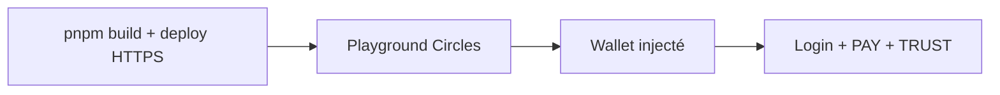

# 04 — Guide développeur

## Démarrage rapide

```bash
git clone <repo-url> THP-for-Good
cd THP-for-Good
pnpm install
cp .env.example .env.local   # adapter les adresses mentors
pnpm dev
```

Ouvrir http://localhost:3000 — le badge affichera « Not connected » (normal).

### Vérification avant merge

```bash
pnpm lint
pnpm build
# Optionnel : smoke test CSP + page d'accueil
pnpm dev &
curl -s -D - http://localhost:3000/ | grep -i frame-ancestors
pkill -f "next dev"
```

## Configuration (`.env`)

| Variable | Obligatoire | Description |
|----------|-------------|-------------|
| `NEXT_PUBLIC_FOUNDATION_ADDRESS` | Recommandé | Adresse groupe THP (`0x2b5E…`) — résolue vers trésor au paiement |
| `NEXT_PUBLIC_BOOKING_PRICE_CRC` | Non | Défaut `100` |
| `NEXT_PUBLIC_MENTOR_*_ADDRESS` | Pour profils live | Adresse Circles par mentor (`ZET`, `FLO`, `DIMITRY`, `VINCENT`) |
| `NEXT_PUBLIC_MENTOR_DEFAULT_ADDRESS` | Alternative | Même adresse pour tous les mentors sans override |
| `NEXT_PUBLIC_RPC_URL` | Non | RPC Gnosis pour receipts (`https://rpc.gnosischain.com`) |

Exemple minimal :

```env
NEXT_PUBLIC_FOUNDATION_ADDRESS=0x2b5E4045936ef12250a8c01e4Cbf71E9bEE69e00
NEXT_PUBLIC_MENTOR_ZET_ADDRESS=0xVotreAdresseChecksummed
```

### Adresses on-chain de référence

| Rôle | Adresse |
|------|---------|
| Groupe THP for Good | `0x2b5E4045936ef12250a8c01e4Cbf71E9bEE69e00` |
| Trésor (BASE_TREASURY) | `0xA98e85AECCfa98220aB20ce60169115C350F09b8` |

Définies aussi dans `lib/config.ts`.

## Structure du projet

```
app/
  layout.tsx              # WalletProvider + AppShell, metadata THP
  page.tsx                # Dashboard (démo connexion)
  mentors/
    layout.tsx            # MentorsShell (Query + Provider)
    page.tsx              # Liste + filtre
    [slug]/page.tsx       # Détail + BookCallButton
  calls/page.tsx          # Historique localStorage
  api/mentors/route.ts    # GET mentors enrichis
components/
  mentors/                # UI métier mentorat
  wallet/                 # WalletProvider, SignInDemo
  layout/                 # Shell, nav, sidebar
  profile/                # Démo boilerplate
hooks/
  use-book-call.ts        # Paiement CRC
  use-trust-mentor.ts     # Trust post-appel
  use-sign-in.ts          # Session signMessage
  use-mentors.ts          # Context mentors (réexport)
lib/
  mentors.ts              # Seeds, créneaux, filtres
  mentor-profiles.server.ts  # Enrichissement Circles (cache)
  crc-transfer.ts         # Construction transactions
  foundation-sink.ts      # Résolution trésor
  bookings-storage.ts     # localStorage
  config.ts               # Constantes THP
  nav.ts                  # Navigation
docs/                     # Cette documentation
```

## Ajouter un mentor (branche `ToXY`)

1. Ajouter une entrée dans `MENTOR_SEEDS` (`lib/mentors.ts`) : `slug`, `name`, `tags`, `bio`.
2. Définir `NEXT_PUBLIC_MENTOR_<SLUG>_ADDRESS` en majuscules dans `.env`.
3. Redémarrer `pnpm dev` — l’API `/api/mentors` revalide le cache toutes les 5 minutes.

## Patterns de code à respecter

### Import dynamique SDK (client)

```tsx
'use client';
useEffect(() => {
  import('@aboutcircles/miniapp-sdk').then(({ onWalletChange }) => {
    const unsub = onWalletChange(setAddress);
    return () => unsub();
  });
}, []);
```

Voir `components/wallet/WalletProvider.tsx`.

### Probe RPC avant nouvelle méthode

```bash
curl -s -X POST https://rpc.aboutcircles.com/ \
  -H "Content-Type: application/json" \
  -d '{"jsonrpc":"2.0","id":1,"method":"circles_getProfileView","params":["0x…"]}'
```

### Script Node de debug (racine projet)

```bash
cat > probe.mjs <<'EOF'
import { Sdk } from '@aboutcircles/sdk';
const sdk = new Sdk();
console.log(await sdk.rpc.profile.getProfileView('0x…'));
EOF
node probe.mjs && rm probe.mjs
```

## Tester dans le playground Circles



1. `git push` → URL Vercel/Coolify.
2. `https://circles.gnosis.io/playground?url=<deploy-url>`
3. Vérifier header : adresse wallet + boutons actifs sur `/mentors/[slug]`.

## Déploiement Coolify

Le fichier `nixpacks.toml` configure :

- Node.js + pnpm
- `pnpm install --frozen-lockfile`
- `pnpm build`
- `HOSTNAME=0.0.0.0 PORT=3000 pnpm start`

**Note historique** : le commit `6af1786` a retiré `pnpm-workspace.yaml` pour corriger l’install Coolify.

Pour SQLite (branche `zet`), préférer un VPS avec volume persistant — les fonctions serverless Vercel ne conservent pas le fichier DB.

## Déploiement Vercel

- Compatible pour la branche `ToXY` (pas de DB fichier).
- Ajouter le domaine preview dans `frame-ancestors` si nécessaire (`next.config.ts`).
- Variables `NEXT_PUBLIC_*` dans le dashboard Vercel.

## Marketplace Circles

Pour une entrée permanente dans le catalogue host, PR sur [aboutcircles/CirclesMiniapps](https://github.com/aboutcircles/CirclesMiniapps) → `static/miniapps.json`.

## Commandes

| Commande | Action |
|----------|--------|
| `pnpm dev` | Serveur dev `:3000` |
| `pnpm build` | Build production |
| `pnpm start` | Serveur production |
| `pnpm lint` | ESLint (pas `next lint` en v16) |

## Pièges connus

| Piège | Solution |
|-------|----------|
| `window is not defined` | Import dynamique SDK côté client uniquement |
| Bouton Connect maison | Utiliser `onWalletChange` — le host est le wallet |
| `getAvatar()` pour lecture seule | Préférer `getProfileView()` |
| Diviser `v2Balance` par 1e18 | Déjà une chaîne décimale |
| Paiement vers adresse groupe | `resolveFoundationSink()` avant transfert |
| Éditer `components/ui/*` à la main | Regénérer via `pnpm dlx shadcn@latest add … --overwrite` |
| Dev server orphelin | `pkill -f "next dev"` en fin de session |

## Ressources internes

- [AGENTS.md](../AGENTS.md) — guide agents IA
- [02 — Architecture](./02-architecture.md) — schémas flux CRC
- [spec/PRD.md](./spec/PRD.md) — cible produit complète
