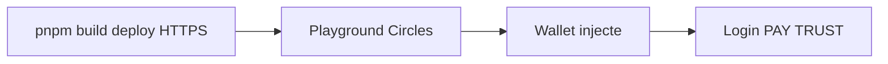

# Guide développeur

[← Guide utilisateur](./03-guide-utilisateur.md) · [Documentation](./README.md) · [Historique →](./05-historique.md)

## Table des matières

- [Démarrage rapide](#démarrage-rapide)
- [Configuration](#configuration-env)
- [Structure du projet](#structure-du-projet)
- [Ajouter un mentor](#ajouter-un-mentor-branche-toxy)
- [Patterns de code](#patterns-de-code-à-respecter)
- [Tester dans Circles](#tester-dans-le-playground-circles)
- [Déploiement](#déploiement-coolify)
- [Pièges connus](#pièges-connus)

---

## Démarrage rapide

```bash
git clone https://github.com/gnosis-box/THP-for-Good.git
cd THP-for-Good
pnpm install
cp .env.example .env.local
pnpm dev
```

Ouvrir `http://localhost:3000` — le badge affiche « Not connected » (normal hors iframe).

### Vérification avant merge

```bash
pnpm lint
pnpm build
pnpm dev &
curl -s -D - http://localhost:3000/ | grep -i frame-ancestors
pkill -f "next dev"
```

## Configuration (`.env`)

Copier [`.env.example`](../.env.example) vers `.env.local`.

| Variable | Obligatoire | Description |
|----------|:-----------:|-------------|
| `NEXT_PUBLIC_FOUNDATION_ADDRESS` | Recommandé | Groupe THP — résolu vers trésor au paiement |
| `NEXT_PUBLIC_BOOKING_PRICE_CRC` | Non | Défaut `100` |
| `NEXT_PUBLIC_MENTOR_*_ADDRESS` | Pour profils live | Adresse Circles par mentor |
| `NEXT_PUBLIC_MENTOR_DEFAULT_ADDRESS` | Alternative | Même adresse pour tous les mentors |
| `NEXT_PUBLIC_RPC_URL` | Non | RPC Gnosis pour receipts |

Exemple minimal :

```dotenv
NEXT_PUBLIC_FOUNDATION_ADDRESS=0x2b5E4045936ef12250a8c01e4Cbf71E9bEE69e00
NEXT_PUBLIC_MENTOR_ZET_ADDRESS=0xVotreAdresseChecksummed
```

### Adresses on-chain

| Rôle | Adresse |
|------|---------|
| Groupe THP for Good | `0x2b5E4045936ef12250a8c01e4Cbf71E9bEE69e00` |
| Trésor (BASE_TREASURY) | `0xA98e85AECCfa98220aB20ce60169115C350F09b8` |

Constantes : [`lib/config.ts`](../lib/config.ts).

## Structure du projet

<details>
<summary>Arborescence principale</summary>

```text
app/
  layout.tsx
  page.tsx
  mentors/
    layout.tsx
    page.tsx
    [slug]/page.tsx
  calls/page.tsx
  api/mentors/route.ts
components/
  mentors/
  wallet/
  layout/
hooks/
  use-book-call.ts
  use-trust-mentor.ts
  use-sign-in.ts
lib/
  mentors.ts
  mentor-profiles.server.ts
  crc-transfer.ts
  foundation-sink.ts
  bookings-storage.ts
  config.ts
docs/
```

</details>

## Ajouter un mentor (branche `ToXY`)

1. Entrée dans `MENTOR_SEEDS` — [`lib/mentors.ts`](../lib/mentors.ts).
2. Variable `NEXT_PUBLIC_MENTOR_<SLUG>_ADDRESS` dans `.env.local`.
3. Redémarrer `pnpm dev` — cache API `/api/mentors` : 5 minutes.

## Patterns de code à respecter

### Import dynamique SDK (client)

```tsx
'use client';

import { useEffect } from 'react';

useEffect(() => {
  import('@aboutcircles/miniapp-sdk').then(({ onWalletChange }) => {
    const unsub = onWalletChange(setAddress);
    return () => unsub();
  });
}, []);
```

Référence : [`components/wallet/WalletProvider.tsx`](../components/wallet/WalletProvider.tsx).

### Probe RPC

```bash
curl -s -X POST https://rpc.aboutcircles.com/ \
  -H "Content-Type: application/json" \
  -d '{"jsonrpc":"2.0","id":1,"method":"circles_getProfileView","params":["0x…"]}'
```

### Script Node de debug

```bash
cat > probe.mjs <<'EOF'
import { Sdk } from '@aboutcircles/sdk';
const sdk = new Sdk();
console.log(await sdk.rpc.profile.getProfileView('0x…'));
EOF
node probe.mjs && rm probe.mjs
```

## Tester dans le playground Circles



1. `git push` → URL Vercel ou Coolify.
2. `https://circles.gnosis.io/playground?url=<deploy-url>`
3. Vérifier wallet + boutons sur `/mentors/[slug]`.

## Déploiement Coolify

Config : [`nixpacks.toml`](../nixpacks.toml).

| Phase | Commande |
|-------|----------|
| Install | `pnpm install --frozen-lockfile` |
| Build | `pnpm build` |
| Start | `HOSTNAME=0.0.0.0 PORT=3000 pnpm start` |

> [!NOTE]
> Le commit `6af1786` a retiré `pnpm-workspace.yaml` pour corriger l’install Coolify.

### Déploiement Vercel

- Compatible branche `ToXY` (pas de fichier SQLite).
- Variables `NEXT_PUBLIC_*` dans le dashboard Vercel.
- Domaine preview autorisé dans `frame-ancestors` si besoin.

### Marketplace Circles

PR sur [aboutcircles/CirclesMiniapps](https://github.com/aboutcircles/CirclesMiniapps) → `static/miniapps.json`.

## Commandes

| Commande | Action |
|----------|--------|
| `pnpm dev` | Serveur dev `:3000` |
| `pnpm build` | Build production |
| `pnpm start` | Serveur production |
| `pnpm lint` | ESLint |

## Pièges connus

| Piège | Solution |
|-------|----------|
| `window is not defined` | Import dynamique SDK, client only |
| Bouton Connect maison | `onWalletChange` — le host est le wallet |
| `getAvatar()` en lecture seule | `getProfileView()` |
| Diviser `v2Balance` par 1e18 | Déjà une chaîne décimale |
| Paiement vers groupe | `resolveFoundationSink()` |
| Éditer `components/ui/*` | `pnpm dlx shadcn@latest add … --overwrite` |
| Dev server orphelin | `pkill -f "next dev"` |

## Ressources

- [AGENTS.md](../AGENTS.md)
- [Architecture](./02-architecture.md)
- [PRD](./spec/PRD.md)

---

[← Guide utilisateur](./03-guide-utilisateur.md) · [Historique →](./05-historique.md)
