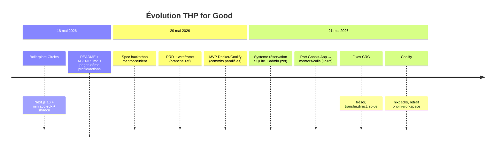
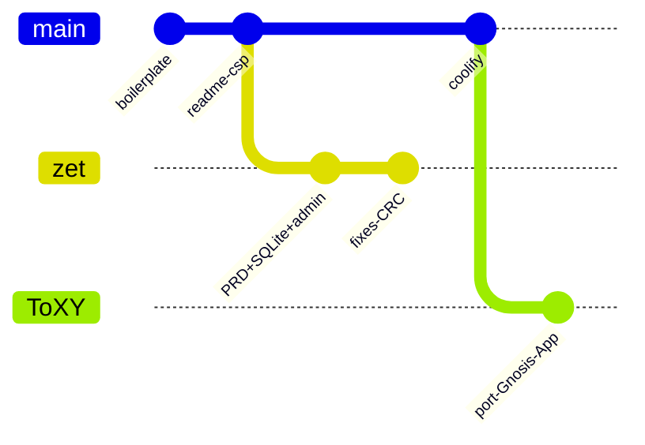
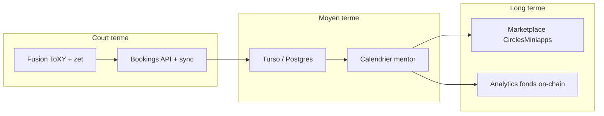

# 05 — Historique & roadmap

Chronologie reconstituée à partir de l’historique Git (mai 2026) et des branches `master`, `ToXY`, `zet`.

## Timeline

## Commits structurants

| Date | Commit | Auteur / thème | Description |
|------|--------|----------------|-------------|
| 2026-05-18 | `6f7321e` | Sandipan Kundu | Create Next App initial |
| 2026-05-18 | `cdf891e` | Sandipan Kundu | **Boilerplate Circles** — WalletProvider, ProfileLookup, nav, CSP iframe |
| 2026-05-18 | `f0366cc` / `f811001` | Sandipan Kundu | README, fix `next.config.ts` |
| 2026-05-20 | `67ff5fa` | — | Spec hackathon mentor ↔ étudiant |
| 2026-05-20 | `a72a7d9` | — | **PRD complet** + tâches + wireframe (`spec/`) |
| 2026-05-20 | `a6dc292` | — | MVP THP + Docker Coolify |
| 2026-05-21 | `58daf89` | — | **Booking system** — SQLite, API, composants mentors |
| 2026-05-21 | `90542ce` | — | Panneau admin mentors + tags |
| 2026-05-21 | `84577a0` | toxy0392 | **Port Gnosis-App** sur branche `ToXY` — routes `/mentors`, `/calls`, paiement CRC, localStorage |
| 2026-05-21 | `ab54c74` / `6af1786` | Pretorya | Config production Coolify, fix pnpm workspace |
| 2026-05-21 | `cb886c9`+ | zet | Fixes : auto-réservation, liste mentors, sink invalide, admin serveur |

## Branches

| Branche | État fonctionnel | Persistance | Idéal pour |
|---------|------------------|-------------|------------|
| **`ToXY`** (courante) | Mentors env, API enrichissement Circles, bookings `localStorage`, trust, paiement 100 CRC | Navigateur | Démo rapide, Vercel, port mobile Gnosis-App |
| **`zet`** | SQLite, inscription mentor, admin, API CRUD complète, calendrier post-paiement | Fichier `*.db` sur VPS | Hackathon complet, exploitation prod |
| **`master`** | Proche boilerplate + déploiement Coolify | — | Base stable hébergement |

## Écarts produit : `ToXY` vs PRD (`zet`)

| Fonctionnalité PRD | `ToXY` | `zet` |
|--------------------|--------|-------|
| Liste mentors + filtre texte | ✅ | ✅ |
| Filtre chips skills (DB) | Tags statiques | ✅ `/api/tags` |
| Paiement CRC → trésor | ✅ | ✅ |
| POST booking serveur | ❌ localStorage | ✅ |
| Lien Google Calendar post-pay | ❌ | ✅ |
| Devenir mentor (register) | ❌ | ✅ `/mentor/register` |
| Admin | ❌ | ✅ `/admin` |
| Page d’accueil = catalogue | ❌ (`/mentors`) | ✅ `/` |

## Corrections techniques notables (mai 2026)

Série de commits sur `zet` documentant l’apprentissage intégration Circles :

1. **Groupe vs trésor** — le pathfinder rejette les groupes ; résolution `BASE_TREASURY` via `eth_call` et `tokenType`.
2. **Montant atto-CRC** — `100 * 10^18` pour `transfer.direct`, pas une chaîne décimale seule.
3. **`transfer.direct` vs `advanced`** — choix direct pour paiements depuis Safe Circles.
4. **Solde insuffisant** — pré-check `findMaxFlow` avant envoi host.
5. **Auto-réservation** — garde si le mentor consulte sa propre fiche.

## Roadmap suggérée

| Priorité | Tâche |
|----------|-------|
| P0 | Merger persistance SQLite (`zet`) avec UI `/mentors` (`ToXY`) |
| P1 | `POST /api/bookings` + abandon localStorage seul |
| P1 | Page register mentor + modération admin |
| P2 | Migration Turso pour Vercel |
| P2 | Ouverture `calendar_link` après paiement réussi |
| P3 | Dashboard trésor : CRC collectés vs places financées |

## Contributeurs (extrait Git)

| Auteur | Contributions principales |
|--------|---------------------------|
| Sandipan Kundu | Boilerplate Circles officiel |
| Pretorya | Déploiement Coolify / Nixpacks |
| toxy0392 | Port Gnosis-App → `ToXY` |
| Équipe zet | PRD, MVP SQLite, admin, fixes CRC |

## Documents liés

- [01 — Présentation](./01-presentation.md)
- [spec/PRD.md](./spec/PRD.md) — plan détaillé avec tâches T01–T14
- [assets/mockup-wireframe.png](./assets/mockup-wireframe.png)
