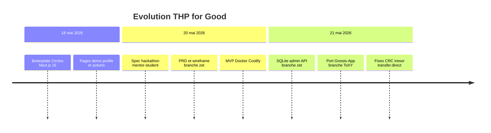
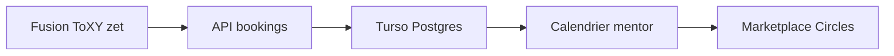

# Historique & roadmap

[← Guide développeur](./04-guide-developpeur.md) · [Documentation](./README.md)

## Table des matières

- [Timeline](#timeline)
- [Commits structurants](#commits-structurants)
- [Branches](#branches)
- [Écarts ToXY vs zet](#écarts-produit-toxy-vs-prd-zet)
- [Corrections techniques](#corrections-techniques-notables-mai-2026)
- [Roadmap](#roadmap-suggérée)

---

Chronologie reconstituée à partir de l’historique Git (mai 2026) et des branches `master`, `ToXY`, `zet`.

## Timeline

## Commits structurants

| Date | Commit | Thème | Description |
|------|--------|-------|-------------|
| 2026-05-18 | [`6f7321e`](https://github.com/gnosis-box/THP-for-Good/commit/6f7321e) | Init | Create Next App |
| 2026-05-18 | `cdf891e` | Boilerplate | WalletProvider, ProfileLookup, CSP iframe |
| 2026-05-20 | `a72a7d9` | PRD | Spec complète + wireframe |
| 2026-05-20 | `a6dc292` | Deploy | MVP + Docker Coolify |
| 2026-05-21 | `58daf89` | Backend | SQLite, API, UI mentors |
| 2026-05-21 | `90542ce` | Admin | Panneau mentors + tags |
| 2026-05-21 | `84577a0` | Port | Gnosis-App → `ToXY` |
| 2026-05-21 | `ab54c74` | Ops | Coolify production |

> [!TIP]
> Voir l’historique complet : [`github.com/gnosis-box/THP-for-Good/commits`](https://github.com/gnosis-box/THP-for-Good/commits).

## Branches

| Branche | Fonctionnel | Persistance | Usage |
|---------|-------------|-------------|-------|
| **`ToXY`** | Mentors `.env`, paiement CRC, trust | `localStorage` | Démo, Vercel, port mobile |
| **`zet`** | SQLite, register, admin, API CRUD | Fichier `.db` VPS | Prod hackathon |
| **`master`** | Boilerplate + Coolify | — | Base hébergement |

## Écarts produit : `ToXY` vs PRD (`zet`)

| Fonctionnalité | `ToXY` | `zet` |
|----------------|:------:|:-----:|
| Liste mentors + filtre texte | Done | Done |
| Filtre chips skills (DB) | Tags statiques | Done |
| Paiement CRC → trésor | Done | Done |
| POST booking serveur | — | Done |
| Google Calendar post-pay | — | Done |
| Devenir mentor | — | Done |
| Admin | — | Done |
| Accueil = catalogue | `/mentors` | `/` |

## Corrections techniques notables (mai 2026)

1. **Groupe vs trésor** — pathfinder rejette les groupes ; `BASE_TREASURY` via `eth_call`.
2. **Montant atto-CRC** — `100 * 10^18` pour `transfer.direct`.
3. **`transfer.direct`** — préféré pour Safe Circles.
4. **Solde** — pré-check `findMaxFlow` avant envoi host.
5. **Auto-réservation** — garde sur fiche mentor propre.

## Roadmap suggérée

| Priorité | Tâche |
|:--------:|-------|
| P0 | Merger SQLite (`zet`) + UI `/mentors` (`ToXY`) |
| P1 | `POST /api/bookings` |
| P1 | Register mentor + admin |
| P2 | Turso pour Vercel |
| P2 | `calendar_link` post-paiement |
| P3 | Dashboard trésor on-chain |

## Contributeurs

| Auteur | Contributions |
|--------|---------------|
| Sandipan Kundu | Boilerplate Circles |
| Pretorya | Coolify / Nixpacks |
| toxy0392 | Port Gnosis-App `ToXY` |
| Équipe zet | PRD, MVP SQLite, fixes CRC |

## Documents liés

- [Présentation](./01-presentation.md)
- [PRD](./spec/PRD.md)
- [Wireframe](./assets/mockup-wireframe.png)

---

[← Guide développeur](./04-guide-developpeur.md) · [Documentation](./README.md)
