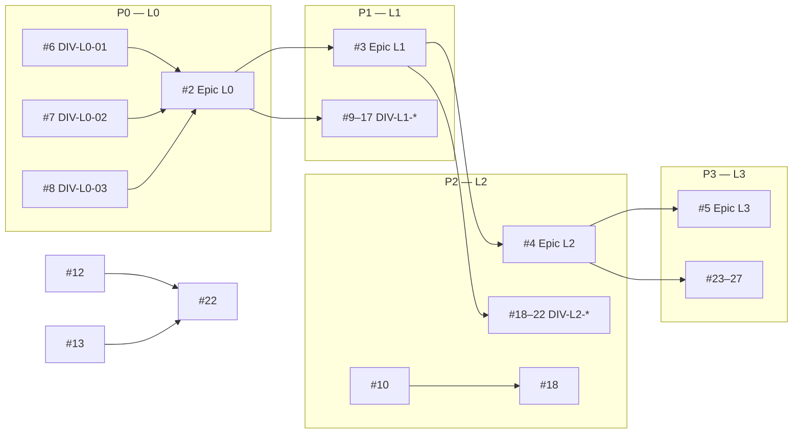

# THP for Good — PRD MVP (index)

| | |
|---|---|
| **Centre de vérité** | [GitHub Project #1](https://github.com/orgs/gnosis-box/projects/1) — statut, priorité, exécution |
| **Index (ce fichier)** | Liens vers issues — **pas** de liste de tâches dupliquée |
| **Repo** | [gnosis-box/THP-for-Good](https://github.com/gnosis-box/THP-for-Good) |
| **Guide code** | [`AGENTS.md`](../AGENTS.md) |
| **Archives** | [`spec/archive/`](archive/README.md) — [`PRD.md`](archive/PRD.md), [`PRD-Mestryx.md`](archive/PRD-Mestryx.md) |
| **Branche** | `zet` |
| **Dernière mise à jour** | 2026-05-21 — **DIV L0–L3 terminées** · exécution [IMPL](#backlog-dimplémentation) |
| **Phase courante** | **IMPL + spikes** — clôturer epic [#5](https://github.com/gnosis-box/THP-for-Good/issues/5) sur GitHub après commentaire récap |

---

## Workflow & board Kanban

**Board :** [Project #1 — View 1](https://github.com/orgs/gnosis-box/projects/1/views/1)

### Deux types d’issues (ne pas confondre)

| Type | Exemple | Rôle | Code ? |
|------|---------|------|--------|
| **`DIV-*`** | [#6](https://github.com/gnosis-box/THP-for-Good/issues/6) | Décision A/B/C | **Non** — fermer après tranchage |
| **`IMPL-*`** | voir [§ Backlog impl](#backlog-dimplémentation) | Travail concret | **Oui** — carte en **Triage** à la création |

**Flux :** `DIV` fermée → si la décision implique du travail → **créer `IMPL-*`** (label `implementation`) en **Triage** → référencer ici → implémenter quand la carte passe Ready/Running.

**Anti-doublon :** avant de créer une `IMPL`, vérifier le tableau [Backlog d’implémentation](#backlog-dimplémentation). Le Project reste la source de vérité pour l’état ; ce fichier ne fait que **indexer** les liens.

### Phase courante : L3 (UX & Demo)

| Layer | Décisions `DIV` | Implémentation `IMPL` |
|-------|-----------------|------------------------|
| **L0** | ✅ [#6](https://github.com/gnosis-box/THP-for-Good/issues/6)–[#8](https://github.com/gnosis-box/THP-for-Good/issues/8) | [IMPL-L0-02/03](#backlog-dimplémentation) |
| **L1** | ✅ Epic [#3](https://github.com/gnosis-box/THP-for-Good/issues/3) · DIV [#9](https://github.com/gnosis-box/THP-for-Good/issues/9)–[#17](https://github.com/gnosis-box/THP-for-Good/issues/17) | [IMPL-L1-*](#backlog-dimplémentation) |
| **L2** | ✅ Epic [#4](https://github.com/gnosis-box/THP-for-Good/issues/4) · DIV [#18](https://github.com/gnosis-box/THP-for-Good/issues/18)–[#22](https://github.com/gnosis-box/THP-for-Good/issues/22) | [SPIKE-L2-01](https://github.com/gnosis-box/THP-for-Good/issues/30) + backlog |
| **L3** | ✅ Epic [#5](https://github.com/gnosis-box/THP-for-Good/issues/5) · DIV [#23](https://github.com/gnosis-box/THP-for-Good/issues/23)–[#27](https://github.com/gnosis-box/THP-for-Good/issues/27) | [IMPL-L3-01/02/05](#backlog-dimplémentation) ; [#26](https://github.com/gnosis-box/THP-for-Good/issues/26) = **B** déjà dans `PayButton` |

**Ordre L2 suggéré :** [#20](https://github.com/gnosis-box/THP-for-Good/issues/20) (admin gate) · [#18](https://github.com/gnosis-box/THP-for-Good/issues/18) (CRC encoding / split PAY) · [#19](https://github.com/gnosis-box/THP-for-Good/issues/19) (TRUST on-chain) · [#22](https://github.com/gnosis-box/THP-for-Good/issues/22) (schéma DB) · [#21](https://github.com/gnosis-box/THP-for-Good/issues/21) (notifs).

*Synchronisation GitHub / board : **manuelle** (commentaire + fermer issue + carte **Done** sur le Project).*

### Colonnes Status (workflow)

| Colonne | Quand l’utiliser |
|---------|------------------|
| **Triage** | Nouvelle carte, pas encore priorisée |
| **Ready** | Débloquée — peut être prise (voir dépendances) |
| **Running** | Décision ou implémentation en cours |
| **Review** | PR / spec à valider avant clôture définitive |
| **Blocked** | En attente d’une autre issue (onglet **Relations** sur l’issue) |
| **Done** | Issue **fermée** + décision ou implémentation **validée** (obligatoire après chaque DIV/IMPL) |

### Champs projet

| Champ | Usage |
|-------|--------|
| **Status** | Colonnes du board (ci-dessus) |
| **Priority** | `P0` … `P3` = ordre L0 → L3 (swimlanes recommandées) |
| **Layer** | Epic technique (Foundation, Product, …) |

### Vue recommandée (UI)

1. Layout **Board**
2. **Columns** = champ **Status**
3. **Group by** = **Priority** (affiche P0 en haut, puis P1, P2, P3)
4. Optionnel : filtre `Layer` pour ne voir qu’un epic

Si les cartes sont vides : ajuster le statut à la main sur le Project selon [§ Placement](#placement-sur-le-board).

### C’est quoi `DIV-L0-01` ?

| Partie | Signification |
|--------|----------------|
| **DIV** | **Décision** — point produit/tech tranché (anciennement écart entre brouillons [`archive/`](archive/README.md)) |
| **L0** | **Layer 0** — priorité fondation (avant produit / intégration / UX) |
| **01** | Numéro de la décision dans ce layer |

**Pourquoi une issue séparée par DIV ?**  
Chaque carte = **une décision binaire/ternaire** (A/B/C), traçable, fermable, commentée. Ce n’est pas une tâche d’implémentation monolithique.

**Peut-on les faire en individuel ?**

| Layer | En parallèle ? | Condition |
|-------|----------------|-----------|
| **L0** (#6–#8) | **Oui** — 3 décisions indépendantes | ✅ **Layer L0 tranché** (2026-05-21) |
| **L1** (#9–#17) | **Oui**, entre elles | **Actif** — L0 DIV terminées ; trancher les DIV L1 (pas d’implémentation dans la même passe) |
| **L2** (#18–#22) | **Oui**, entre elles | Bloquées tant que [#3](https://github.com/gnosis-box/THP-for-Good/issues/3) (epic L1) est ouvert |
| **L3** (#23–#27) | **Oui**, entre elles | Bloquées tant que [#4](https://github.com/gnosis-box/THP-for-Good/issues/4) (epic L2) est ouvert |

**Epics [#2–#5](https://github.com/gnosis-box/THP-for-Good/issues/2)** : regroupement / priorité ; les sous-issues portent le vrai travail de décision.

### Dépendances (bloquants)

| Issue | Bloquée par | Raison |
|-------|-------------|--------|
| #3, #9–#17 | #2 | Layer L1 après fondation |
| #4, #18–#22 | #3 | Layer L2 après produit MVP |
| #5, #23–#27 | #4 | Layer L3 après intégration |
| #18 | #10 | Encodage CRC → destinataire trésorerie d’abord |
| #22 | #12, #13 | Schéma DB tag/slot après décisions trust & slots |

### Placement sur le board

| Type | Status initial / suivi |
|------|------------------------|
| `DIV` **ouverte** | Ready ou Blocked |
| `DIV` **fermée** | Issue GitHub **closed** (carte peut rester sur le board ou être filtrée) |
| **`IMPL-*` nouvelle** | **Triage** obligatoire |
| **`IMPL-*` en cours** | Ready → Running → Review → close |

### Trancher une `DIV` (checklist)

Voir [`AGENTS.md`](../AGENTS.md).

1. Commenter + **fermer** l’issue `DIV-*` (texte type ci-dessous ou dans le chat)
2. Carte Project → **Done** (manuel)
3. Mettre à jour § [Décisions tranchées](#décisions-tranchées) + architecture **cible**
4. Créer **`IMPL-*`** si besoin → **Triage** ([backlog](#backlog-dimplémentation))
5. **Pas** de code dans cette étape

---

## Vision (résumé)

Miniapp **Circles** : échanges d’**expertise** au sein de THP for Good (pas un couple fixe élève / mentor). Une même personne peut **demander** de l’aide sur un domaine et **en offrir** sur un autre. Sessions payées en **CRC** : parcourir les profils → réserver → payer → calendrier → TRUST post-session sur **`/calls`**.

**Paiement (DIV-L1-02) :** split CRC — fondation **≥ 50%** (`0x2b5E4045936ef12250a8c01e4Cbf71E9bEE69e00`) + part de l’**expert** **10 / 20 / 30 / 50%**. Admin règle le plancher fondation.

### Terminologie (UI & spec)

| À éviter dans l’UI (binaire scolaire) | Préférer | Rôle technique (inchangé MVP) |
|--------------------------------------|----------|-------------------------------|
| Student / élève | **Participant** | `booker_address` |
| Mentor (seul sens) | **Expert** / profil avec expertise | table `mentors`, `mentor_id` |
| My Calls (seul onglet) | **`/calls`** — section **Émis** | réservations que **j’ai payées** |
| My slots / vue mentor séparée | **`/calls`** — section **Reçus** | réservations où **mon profil expert** est booké |
| Become a Mentor | **Offer your expertise** (ou FR : *Proposer ton expertise*) | `/mentor/register` |

*Les noms de tables/routes `mentor/*` restent en code pour le MVP ; seuls libellés et copy UI évoluent.*

---

## Layers & epics (ordre de priorité)

| Priorité | Layer | Epic | Scope |
|:--------:|-------|------|--------|
| 1 | **L0 — Foundation** | [#2](https://github.com/gnosis-box/THP-for-Good/issues/2) | Persistance, deploy, routes |
| 2 | **L1 — Product MVP** | [#3](https://github.com/gnosis-box/THP-for-Good/issues/3) | ✅ DIV #9–#17 — règles métier verrouillées ([clôture](#clôture-epic-l1)) |
| 3 | **L2 — Integration** | [#4](https://github.com/gnosis-box/THP-for-Good/issues/4) | ✅ DIV #18–#22 — on-chain & backend ([clôture](#clôture-epic-l2)) |
| 4 | **L3 — UX & Demo** | [#5](https://github.com/gnosis-box/THP-for-Good/issues/5) | ✅ **DIV [#23–#27](https://github.com/gnosis-box/THP-for-Good/issues/23) terminées** — clôturer epic + [IMPL L3](#backlog-dimplémentation) |

---

## Clôture epic L1

**Epic :** [#3 — Product MVP](https://github.com/gnosis-box/THP-for-Good/issues/3)  
**Critère de clôture :** les 9 issues `DIV-L1-01` … `DIV-L1-09` ([#9](https://github.com/gnosis-box/THP-for-Good/issues/9)–[#17](https://github.com/gnosis-box/THP-for-Good/issues/17)) sont **décidées** et référencées dans [§ Décisions tranchées](#décisions-tranchées) + [terminologie](#terminologie-ui--spec).

**Livrable de cette phase :** règles métier verrouillées (pas le code). L’exécution = issues **`IMPL-L*`** sur le board.

**Suite :** epic [#4 — L2 Integration](https://github.com/gnosis-box/THP-for-Good/issues/4) · puis [#5 — L3](https://github.com/gnosis-box/THP-for-Good/issues/5).

---

## Clôture epic L2

**Epic :** [#4 — Integration](https://github.com/gnosis-box/THP-for-Good/issues/4)  
**Critère :** les 5 issues `DIV-L2-01` … `DIV-L2-05` ([#18](https://github.com/gnosis-box/THP-for-Good/issues/18)–[#22](https://github.com/gnosis-box/THP-for-Good/issues/22)) sont **décidées** dans [§ Décisions tranchées](#décisions-tranchées).

**Livrable :** choix d’intégration Circles + backend (encodage CRC, TRUST, admin, notif, schéma). **Code** = `IMPL-*` + [SPIKE-L2-01 #30](https://github.com/gnosis-box/THP-for-Good/issues/30).

**Suite :** epic [#5 — L3 UX & Demo](https://github.com/gnosis-box/THP-for-Good/issues/5) · DIV [#23](https://github.com/gnosis-box/THP-for-Good/issues/23)–[#27](https://github.com/gnosis-box/THP-for-Good/issues/27).

---

## Clôture epic L3

**Epic :** [#5 — UX & Demo](https://github.com/gnosis-box/THP-for-Good/issues/5)  
**Critère :** les 5 issues `DIV-L3-01` … `DIV-L3-05` ([#23](https://github.com/gnosis-box/THP-for-Good/issues/23)–[#27](https://github.com/gnosis-box/THP-for-Good/issues/27)) sont **décidées** dans [§ Décisions tranchées](#décisions-tranchées).

| DIV | Choix |
|-----|-------|
| L3-01 [#23](https://github.com/gnosis-box/THP-for-Good/issues/23) | **B** — mobile-first, pas sidebar desktop |
| L3-02 [#24](https://github.com/gnosis-box/THP-for-Good/issues/24) | **A** — `OpenInCirclesHint` hors iframe |
| L3-03 [#25](https://github.com/gnosis-box/THP-for-Good/issues/25) | **A** — UI **EN** MVP |
| L3-04 [#26](https://github.com/gnosis-box/THP-for-Good/issues/26) | **B** — succès PAY : slot + GnosisScan + cal (déjà dans `PayButton`) |
| L3-05 [#27](https://github.com/gnosis-box/THP-for-Good/issues/27) | **A** — `trustedByCount` sur `MentorCard` |

**Livrable de cette phase :** spec UX/demo verrouillée (pas tout le code).  
**Exécution :** [IMPL-L3-01](#backlog-dimplémentation), **IMPL-L3-02**, **IMPL-L3-05** (+ backlog L0–L2 existant).  
**Suite produit :** spikes [#30](https://github.com/gnosis-box/THP-for-Good/issues/30) / [#31](https://github.com/gnosis-box/THP-for-Good/issues/31), [L4](#l4--post-mvp-backlog).

---

## Registre des décisions → issues

### L0 — Foundation

| ID | Sujet | Issue | Statut |
|----|-------|-------|--------|
| DIV-L0-01 | Persistance app | [#6](https://github.com/gnosis-box/THP-for-Good/issues/6) | ✅ **A** — SQLite + API |
| DIV-L0-02 | Hébergement & DB durable | [#7](https://github.com/gnosis-box/THP-for-Good/issues/7) | ✅ **A** — Coolify + Docker + volume |
| DIV-L0-03 | Routes canoniques | [#8](https://github.com/gnosis-box/THP-for-Good/issues/8) | ✅ **A′** — PRD routes + `/calls` (pas `/history`) |

### L1 — Product MVP *(DIV terminées — epic [#3](https://github.com/gnosis-box/THP-for-Good/issues/3))*

| ID | Sujet | Issue | Statut |
|----|-------|-------|--------|
| DIV-L1-01 | Prix d’une session | [#9](https://github.com/gnosis-box/THP-for-Good/issues/9) | ✅ **A** — prix par mentor |
| DIV-L1-02 | Destinataire du PAY | [#10](https://github.com/gnosis-box/THP-for-Good/issues/10) | ✅ **D** — split 50% min fondation + mentor 10–50% |
| DIV-L1-03 | Catalogue de tags | [#11](https://github.com/gnosis-box/THP-for-Good/issues/11) | ✅ **C** — admin + proposition mentor |
| DIV-L1-04 | TRUST post-call | [#12](https://github.com/gnosis-box/THP-for-Good/issues/12) | ✅ **A** — TRUST mentor uniquement |
| DIV-L1-05 | Créneaux (slots) | [#13](https://github.com/gnosis-box/THP-for-Good/issues/13) | ✅ **A** — UI statique ; `slot_label` DB plus tard |
| DIV-L1-06 | Publication mentor | [#14](https://github.com/gnosis-box/THP-for-Good/issues/14) | ✅ **A′** — auto-inscription + admin promote |
| DIV-L1-07 | Admin dans la nav | [#15](https://github.com/gnosis-box/THP-for-Good/issues/15) | ✅ **A** — URL cachée `/admin` uniquement |
| DIV-L1-08 | Historique des calls | [#16](https://github.com/gnosis-box/THP-for-Good/issues/16) | ✅ **D** — `/calls` émis + reçus (pas `/my-slots`) |
| DIV-L1-09 | Solde CRC insuffisant | [#17](https://github.com/gnosis-box/THP-for-Good/issues/17) | ✅ **B** — erreur au clic (toast) |

### L2 — Integration *(DIV terminées — epic [#4](https://github.com/gnosis-box/THP-for-Good/issues/4))*

| ID | Sujet | Issue | Statut |
|----|-------|-------|--------|
| DIV-L2-01 | Encodage transfert CRC | [#18](https://github.com/gnosis-box/THP-for-Good/issues/18) | ✅ **C′** — SDK + spike split [#30](https://github.com/gnosis-box/THP-for-Good/issues/30) |
| DIV-L2-02 | Chemin TRUST on-chain | [#19](https://github.com/gnosis-box/THP-for-Good/issues/19) | ✅ **C** — SDK direct ; repli `sendTransactions` si playground échoue |
| DIV-L2-03 | Gate admin | [#20](https://github.com/gnosis-box/THP-for-Good/issues/20) | ✅ **B** — `ADMIN_ADDRESSES` ∪ table `admins` |
| DIV-L2-04 | Notification expert | [#21](https://github.com/gnosis-box/THP-for-Good/issues/21) | ✅ **A** — post-MVP ; cal externe + `/calls` Reçus |
| DIV-L2-05 | Champs DB slot / skill_tag | [#22](https://github.com/gnosis-box/THP-for-Good/issues/22) | ✅ **A** — schéma minimal ; trust-back domaine → L4 |

### L3 — UX & Demo

| ID | Sujet | Issue |
|----|-------|-------|
| DIV-L3-01 | Layout navigation | [#23](https://github.com/gnosis-box/THP-for-Good/issues/23) | ✅ **B** — mobile-first (pas sidebar desktop) |
| DIV-L3-02 | Hors iframe Circles | [#24](https://github.com/gnosis-box/THP-for-Good/issues/24) | ✅ **A** — hint dédié « Open in Circles » |
| DIV-L3-03 | Langue UI | [#25](https://github.com/gnosis-box/THP-for-Good/issues/25) | ✅ **A** — EN MVP ; i18n v2 |
| DIV-L3-04 | Écran succès booking | [#26](https://github.com/gnosis-box/THP-for-Good/issues/26) | ✅ **B** — GnosisScan + slot + bouton cal |
| DIV-L3-05 | Affichage trustback | [#27](https://github.com/gnosis-box/THP-for-Good/issues/27) | ✅ **A** — compteur `trustedBy` sur carte mentor |

---

## Décisions tranchées

| ID | Choix | Date | Issue |
|----|-------|------|-------|
| **DIV-L0-01** | **A** — SQLite + API Route Handlers (`better-sqlite3`, `/api/*`). Pas de `mentors.json` ni `localStorage` (branche `mestryx` exclue). | 2026-05-21 | [#6](https://github.com/gnosis-box/THP-for-Good/issues/6) (closed) |
| **DIV-L0-02** | **A** — **Coolify** + **`Dockerfile`** (`output: 'standalone'`) + **volume persistant** pour SQLite (`/app/data`). Pas Vercel/Turso MVP. | 2026-05-21 | [#7](https://github.com/gnosis-box/THP-for-Good/issues/7) (closed) |
| **DIV-L0-03** | **A′** — Routes canoniques : `/`, `/mentor/[id]`, `/mentor/register`, **`/calls`**, `/admin`. **`/history` → redirect `/calls`**. Pas `/mentors/*`. | 2026-05-21 | [#8](https://github.com/gnosis-box/THP-for-Good/issues/8) (closed) |
| **DIV-L1-01** | **A** — `price_crc` **par mentor** (défaut 100), affiché carte + PAY. | 2026-05-21 | [#9](https://github.com/gnosis-box/THP-for-Good/issues/9) (closed) |
| **DIV-L1-02** | **D** — Split : admin **≥ 50%** fondation ; mentor choisit **10 / 20 / 30 / 50%** pour lui ; le reste → fondation. | 2026-05-21 | [#10](https://github.com/gnosis-box/THP-for-Good/issues/10) (closed) |
| **DIV-L1-03** | **C** — Catalogue admin ; mentor **propose** un tag (page mentor) ; admin **valide / modifie** les tags. | 2026-05-21 | [#11](https://github.com/gnosis-box/THP-for-Good/issues/11) (closed) |
| **DIV-L1-04** | **A** — TRUST post-call : **`trust.add(mentor)`** uniquement ; pas de picker tag, pas d’index tag MVP. | 2026-05-21 | [#12](https://github.com/gnosis-box/THP-for-Good/issues/12) (closed) |
| **DIV-L1-05** | **A** — `SlotPicker` UI statique ; lien `calendar_link` mentor après PAY ; **`slot_label` en DB reporté** ; pas dispo/agenda en DB (≠ B/C). | 2026-05-21 | [#13](https://github.com/gnosis-box/THP-for-Good/issues/13) (closed) |
| **DIV-L1-06** | **A′** — **Deux voies** : (1) la personne s’inscrit mentor (`/mentor/register`) → visible si `active=1` ; (2) admin **promote** un membre / gère la fiche. Admin peut **désactiver** (`active=0`). Pas admin-only (≠ C). | 2026-05-21 | [#14](https://github.com/gnosis-box/THP-for-Good/issues/14) (closed) |
| **DIV-L1-07** | **A** — Pas de lien Admin dans la navigation publique ; accès **`/admin` par URL** (bookmark / lien interne). | 2026-05-21 | [#15](https://github.com/gnosis-box/THP-for-Good/issues/15) (closed) |
| **DIV-L1-08** | **D** — Une seule page **`/calls`** : onglets/sections **Calls emitted** (j’ai booké un expert) + **Calls received** (on a booké mon profil). Pas de route `/my-slots`. | 2026-05-21 | [#16](https://github.com/gnosis-box/THP-for-Good/issues/16) (closed) |
| **DIV-L1-09** | **B** — Bouton PAY **actif** sans pré-vérification du solde ; à l’échec de la tx → **toast** (message clair, ex. « Not enough CRC »). | 2026-05-21 | [#17](https://github.com/gnosis-box/THP-for-Good/issues/17) (closed) |
| **DIV-L2-01** | **C′** — **`TransferBuilder` + `sendTransactions`** (base option C) ; destinataire fondation `0x2b5E…` ; **spike obligatoire** pour split [DIV-L1-02](#détail-div-l1-02) avant `IMPL-L1-02`. Repli documenté : viem manuel (B) si le SDK ne permet pas 2 legs en une UX. | 2026-05-21 | [#18](https://github.com/gnosis-box/THP-for-Good/issues/18) (closed) |
| **DIV-L2-02** | **C** — `trust.add(expert)` via SDK direct ; fallback `sendTransactions` si échec playground. Trust-back par domaine → L4. | 2026-05-21 | [#19](https://github.com/gnosis-box/THP-for-Good/issues/19) (closed) |
| **DIV-L2-03** | **B** — Admin = `ADMIN_ADDRESSES` **ou** ligne `admins` ; `isAdminAddress()` canonique. | 2026-05-21 | [#20](https://github.com/gnosis-box/THP-for-Good/issues/20) (closed) |
| **DIV-L2-04** | **A** — Pas de notif email/webhook MVP ; `calendar_link` + `/calls` Reçus ; n8n/GCal plus tard. | 2026-05-21 | [#21](https://github.com/gnosis-box/THP-for-Good/issues/21) (closed) |
| **DIV-L2-05** | **A** — Schéma actuel ; pas `slot_label` / `skill_tag_id` avant FEAT trust-back ou IMPL-L1-05. | 2026-05-21 | [#22](https://github.com/gnosis-box/THP-for-Good/issues/22) (closed) |
| **DIV-L3-01** | **B** — **Mobile-first** : nav via header + menu (ex. `MobileNav`) ; **pas** de sidebar persistante `md+`. | 2026-05-21 | [#23](https://github.com/gnosis-box/THP-for-Good/issues/23) (closed) |
| **DIV-L3-02** | **A** — Composant / bandeau **dédié** hors iframe (`OpenInCirclesHint`) avec lien playground ; pas seulement texte générique dispersé. | 2026-05-21 | [#24](https://github.com/gnosis-box/THP-for-Good/issues/24) (closed) |
| **DIV-L3-03** | **A** — **UI en anglais** pour le hackathon MVP ; **multilingue (FR/EN)** reporté **v2** / L4. | 2026-05-21 | [#25](https://github.com/gnosis-box/THP-for-Good/issues/25) (closed) |
| **DIV-L3-04** | **B** — Après PAY réussi : panneau succès avec **créneau choisi**, lien **GnosisScan** (`tx_hash`), bouton **Open calendar link** (pas d’auto-open). | 2026-05-21 | [#26](https://github.com/gnosis-box/THP-for-Good/issues/26) (closed) |
| **DIV-L3-05** | **A** — Afficher **`trustStats.trustedByCount`** (Circles) sur **`MentorCard`** (grille accueil) ; pas de section dédiée fiche MVP ; pas de réputation par tag. | 2026-05-21 | [#27](https://github.com/gnosis-box/THP-for-Good/issues/27) (closed) |

### Détail DIV-L3-05

- **Scope MVP :** réputation **globale** Circles (`getProfileView` → `trustStats`), pas trust-back par domaine ([DIV-L1-04](#détail-div-l1-04), [FEAT Trust-back](#feat--trust-back-par-domaine-créibilité-expert)).
- **Où :** ligne discrète sur chaque **`MentorCard`** — ex. « Trusted by **N** » (EN, [DIV-L3-03](#détail-div-l3-03)).
- **Chargement :** côté client après rendu de la carte, `sdk.rpc.profile.getProfileView(mentor.circles_address)` ; dégradation gracieuse si pas d’avatar Circles (pattern [`ProfileLookup`](../components/profile/ProfileLookup.tsx)).
- **Hors scope MVP :** **B** bloc dédié sur `/mentor/[id]` ; **C** aucun affichage ; agrégation par `skill_tags` (L4).
- **Code `zet` :** `MentorCard` sans overlay — **IMPL-L3-05** requis (hook partagé type `useMentorCirclesOverlay`).

**IMPL Triage :** [`IMPL-L3-05`](#backlog-dimplémentation).

### Détail DIV-L3-04

- Remplace l’état bouton PAY par un **bloc succès** inline sur la fiche expert (pas de route dédiée).
- Contenu obligatoire :
  - Message de confirmation (EN UI, [DIV-L3-03](#détail-div-l3-03)).
  - **Slot** : libellé du créneau sélectionné dans `SlotPicker` ([DIV-L1-05](#détail-div-l1-05)).
  - **Tx** : lien `https://gnosisscan.io/tx/{hash}` (tronqué lisible).
  - **Cal** : `window.open(mentor.calendar_link)` au clic — l’utilisateur choisit d’ouvrir l’agenda ([DIV-L1-05](#détail-div-l1-05), [DIV-L2-04](#détail-div-l2-04)).
- Rejeté : **A** minimal (tx seule ou toast) ; **C** auto-open cal (trop intrusif en iframe / popup).
- **Code `zet` :** `PayButton.tsx` correspond déjà à **B** — pas d’`IMPL-L3-04` sauf polish copy/accessibilité.

### Détail DIV-L3-03

- Tous les libellés produit, boutons, toasts, erreurs : **English**.
- Spec / chat équipe / ce PRD : **français** — seule l’**UI runtime** de l’app est en **anglais** ([DIV-L3-03](#détail-div-l3-03)).
- **v2 :** i18n (`next-intl` ou équivalent), FR + EN au minimum — pas d’IMPL MVP sauf audit strings FR résiduelles.
- Rejeté MVP : **B** UI FR seule, **C** bilingue dès maintenant.

**IMPL :** aucune obligatoire si `zet` déjà 100 % EN UI.

### Détail DIV-L3-02

- Si `!isMiniappHost` (`WalletProvider`) : afficher un **hint dédié** visible (accueil + pages critiques PAY/TRUST).
- Contenu type : « Ouvrir dans Circles » → `https://circles.gnosis.io/playground?url=<APP_URL>`.
- Hors iframe : wallet non injecté = **comportement attendu**, pas un bug ([`AGENTS.md`](../AGENTS.md)).
- Rejeté : **B** copie générique seule dans `ConnectionCard` ; **C** les deux (redondant si A bien fait).

**IMPL Triage :** `IMPL-L3-02` — composant `OpenInCirclesHint` + intégration layout.

### Détail DIV-L3-01

- Cible : miniapp Circles = viewport mobile ; layout pensé **petit écran d’abord**.
- **Pas** de colonne sidebar fixe sur desktop (≠ A, ≠ C bottom tab bar pour l’instant).
- `AppShell` : une colonne — `Header` (wallet + hamburger) + `main` ; retirer ou masquer `Sidebar` sur tous breakpoints.
- `lib/nav.ts` : libellé **Calls** ([DIV-L1-08](https://github.com/gnosis-box/THP-for-Good/issues/16)) ; pas Admin ([DIV-L1-07](https://github.com/gnosis-box/THP-for-Good/issues/15)).

**IMPL Triage :** `IMPL-L3-01` — refactor `AppShell` / `Sidebar` / `MobileNav`.

### Détail DIV-L2-02

- MVP : `TrustButton` → `getAvatar(participant).trust.add(expert)` ; `POST /api/trust` best-effort.
- Si échec dans l’iframe Circles → encoder via `sendTransactions` ([DIV-L2-01](#détail-div-l2-01) même modèle que PAY).
- Pas de `skill_tag_id` en base ([DIV-L1-04](#détail-div-l1-04), [DIV-L2-05](#détail-div-l2-05)).

### Détail DIV-L2-03

- Bootstrap : `ADMIN_ADDRESSES` (env Coolify).
- Promote : table `admins` via `/admin`.
- **IMPL :** unifier les routes qui utilisent encore `isAdmin()` env-only → `isAdminAddress()`.

### Détail DIV-L2-04

- Pas de `notify-booking` / n8n / Resend au hackathon.
- Couverture partielle : lien cal après PAY ; expert voit les réservations (IMPL `/calls` Reçus).

### Détail DIV-L2-05

- `skill_tags` = domaines **profil** expert, pas tag d’attestation par booking.
- `trustStats` = lecture Circles, pas colonne SQLite.
- `slot_label` / `skill_tag_id` → [IMPL-L1-05](#backlog-dimplémentation) ou [FEAT Trust-back](#feat--trust-back-par-domaine-créibilité-expert).

### Détail DIV-L2-01

**Contexte :** le code actuel (`PayButton`) fait un seul `constructAdvancedTransfer` → 100 % vers l’expert. [DIV-L1-02](#détail-div-l1-02) exige un **split** expert + fondation.

| Hypothèse à valider (spike) | Question |
|-----------------------------|--------|
| Multi-tx batch | `constructAdvancedTransfer` × 2 (expert % + fondation %) → concat → **un seul** `sendTransactions([...])` accepté par le host Circles ? |
| UX wallet | L’utilisateur signe **une** fois ou doit confirmer deux fois ? |
| Montants | Parts 10–50 % expert + reste fondation sur `price_crc` ; respect plancher admin ≥ 50 % fondation |
| Repli | Si échec playground → issue note + option **B** (viem / calldata manuel) |

**Tâches :**

1. **[SPIKE-L2-01](https://github.com/gnosis-box/THP-for-Good/issues/30)** — faisabilité split PAY (playground + `docs/spike-split-pay.md` ou commentaire GO/NO-GO).
2. **[`IMPL-L1-02`](#backlog-dimplémentation)** — **après** spike ; implémente l’encodage retenu.

**Rejeté pour l’instant :** viem seul (B) sans essai SDK ; impl split sans spike.

### Détail DIV-L1-09

- **Pas** de désactivation préventive du PAY si `balance < price_crc` (≠ A, ≠ C).
- Au clic : `sendTransactions` ; si rejet / erreur solde → **toast** (pas seulement texte inline sous le bouton).
- Mapper les erreurs SDK/host vers un message utilisateur lisible ; fallback générique si message opaque.
- Montant de référence : `mentor.price_crc` ([DIV-L1-01](#détail-div-l1-01)).

**IMPL Triage :** [`IMPL-L1-09`](#backlog-dimplémentation) — toast + mapping erreur dans `PayButton.tsx`.

### Détail DIV-L1-08

| Section `/calls` | Filtre | Actions typiques |
|------------------|--------|------------------|
| **Émis** (emitted) | `booker_address = wallet` | TRUST vers l’expert ([DIV-L1-04](#détail-div-l1-04)), lien cal expert |
| **Reçus** (received) | `mentors.circles_address = wallet` | Vue read-only : qui a booké, montant, date ; pas de TRUST ici |

- Rejeté : **A** `/my-slots` post-MVP séparé ; **B** page mentor isolée ; **C** post-hackathon sans spec unifiée.
- Même wallet peut avoir des lignes dans **les deux** sections (expertise croisée).
- Nav : libellé **`Calls`** (pas « My Calls » seul sens participant).

**IMPL Triage :** [`IMPL-L1-08`](#backlog-dimplémentation) — UI deux sections + `GET /api/bookings` côté expert (ex. `?provider_address=`). Peut être regroupé avec [`IMPL-L0-03`](#backlog-dimplémentation) si une seule PR.

### Détail DIV-L1-01

- Chaque mentor définit `price_crc` à l’inscription / édition admin.
- Pas de prix global unique (≠ option B 100 CRC fixe).

### Détail DIV-L1-02

| Part | Règle |
|------|--------|
| Fondation | Adresse trésorerie THP for Good ; **minimum 50%** du montant (réglage admin) |
| Mentor | Choisit sa part : **10%, 20%, 30% ou 50%** ; complément vers fondation |
| Exemple | Prix 100 CRC, mentor 20% → 20 mentor + 80 fondation |

**IMPL :** [`IMPL-L1-02`](#backlog-dimplémentation) — **bloqué par** [`SPIKE-L2-01`](#backlog-dimplémentation) (faisabilité encodage split).

### Détail DIV-L1-03

- Tags canoniques en base (`skill_tags`), gérés en admin.
- Mentor peut **proposer** un nouveau tag depuis sa fiche / register.
- Admin **approuve, renomme ou supprime** (pas tags 100% libres sans modération).

**IMPL :** [`IMPL-L1-03`](#backlog-dimplémentation).

### Détail DIV-L1-07

- `lib/nav.ts` : **pas** d’entrée `{ href: '/admin', label: 'Admin' }` dans `NAV`.
- Route `app/admin` reste valide ; gate admin côté page/API ([DIV-L2-03](#registre-des-décisions--issues)).
- Rejeté : **B** lien Admin visible pour tous dans la barre de nav.

**IMPL Triage :** [`IMPL-L1-07`](#backlog-dimplémentation) — retirer Admin de `NAV` (écart actuel sur `zet`).

### Détail DIV-L1-06

| Voie | Flux | Listing `/` |
|------|------|-------------|
| **Self-serve (A)** | Wallet connecté → `/mentor/register` → `POST /api/mentors` → `active=1` par défaut | Visible tout de suite sur la grille |
| **Admin (B)** | `/admin` → Promote group member → fiche mentor complétée | Même table `mentors` ; admin peut **Activate / Deactivate** |

- **Pas** de file d’attente « modération avant publication » pour l’auto-inscription (≠ B seul de l’issue).
- **Pas** réservé au seed admin (≠ C).
- Code `zet` : `insertMentor` + `PromoteSection` + toggle `active` — aligné ; durcissement optionnel : n’autoriser le register qu’avec l’adresse wallet connectée.

**IMPL Triage :** aucune obligatoire. Optionnel : `IMPL-L1-06` (guard wallet sur register + doc UX).

### Détail DIV-L1-05

| MVP (maintenant) | Plus tard |
|------------------|-----------|
| Grille `SlotPicker` (jour/heure fictifs) — sélection obligatoire avant PAY | Colonne optionnelle `bookings.slot_label` (texte du créneau choisi) |
| Après PAY : bouton **Open calendar link** → `mentors.calendar_link` (URL saisie à l’inscription) | **Google Calendar API** ou **[cal.diy](https://www.cal.diy/installation)** (self-host Cal.com) — **hors MVP** ; faisabilité cal.diy → [SPIKE-L4-01 #31](https://github.com/gnosis-box/THP-for-Good/issues/31) ; notifs → [DIV-L2-04](#registre-des-décisions--issues) / [L4](#l4--post-mvp-backlog) |

- Rejeté pour le hackathon : **B** disponibilités en DB, **C** JSON slots par mentor.
- Code `zet` : `SlotPicker` + `calendar_link` déjà présents ; `bookings` sans `slot_label` — OK tant que la persistance du créneau n’est pas requise.

**IMPL Triage :** aucune **obligatoire** maintenant. Optionnel plus tard : `IMPL-L1-05` (migration `slot_label` + API booking) si l’historique doit afficher le créneau exact.

### Détail DIV-L1-04

**MVP (hackathon — en cours)**

- Après PAY : TRUST dans **`/calls` → Émis** → `trust.add(expert)` (graphe Circles, une fois par booking).
- Établit la **relation de confiance de base** participant → expert ; alimente `trustStats` côté Circles.
- **Pas** d’attestation par domaine / tag dans ce sprint (≠ options B/C de l’issue #12).

**Prochaine feature — crédibilité par expertise** → [FEAT — Trust-back par domaine](#feat--trust-back-par-domaine-créibilité-expert) (L4 / L3, pas L1).

### FEAT — Trust-back par domaine (crédibilité expert)

*Hors scope MVP actuel. À planifier après L2 + fondations tags ([DIV-L1-03](#détail-div-l1-03)).*

| Objectif | Détail |
|----------|--------|
| **Attester l’expertise** | Après un call **émis**, le participant confirme que l’expert mérite la confiance **sur le(s) domaine(s)** proposés sur la fiche (`skill_tags` / tag de la session). |
| **Trust-back** | Lien app entre attestation on-chain (ou Intuition post-mainnet) + **tag** + `booking_id` → réputation **par domaine**, pas seulement un trust global. |
| **Réputation / crédibilité** | Agrégation visible : cartes profil, `/calls`, admin — monter l’expert en crédibilité dans les domaines où il a reçu des attestations post-session. |
| **Prérequis** | Booking payé + session considérée terminée (à affiner : date slot / statut `completed`) ; catalogue tags ([DIV-L1-03](#détail-div-l1-03)) ; chemin tx TRUST ([DIV-L2-02](#registre-des-décisions--issues) #19). |

**Pistes techniques (à trancher plus tard)**

- Index local `trust_attestations` + `skill_tag_id` (ou Intuition Trust/NoTrust en [L4](#l4--post-mvp-backlog)).
- UX : picker de domaine(s) sur la ligne booking Émis ; réputation par tag sur fiche / admin (≠ [DIV-L3-05](#détail-div-l3-05) = compteur global sur carte).
- Circles seul ne porte pas le trust « par compétence » natif — la sémantique domaine reste **côté app** jusqu’à Intuition.

**Issue GitHub :** *à créer* — ex. `FEAT-L4-01` ou epic dédiée réputation.

### Détail DIV-L0-01

- **Persistance :** SQLite via `better-sqlite3`, migrations `lib/schema.sql`, accès `lib/db.ts`.
- **API :** Next.js Route Handlers sous `app/api/` (mentors, bookings, tags, trust, admin).
- **Exclu :** `data/mentors.json`, `lib/bookings-storage.ts` / `localStorage` de l’archive `mestryx`.

### Détail DIV-L0-02

- **Hébergement :** Coolify (self-hosted PaaS), HTTPS pour playground Circles.
- **Container :** `Dockerfile` + `.dockerignore` ; `next.config.ts` → `output: 'standalone'`.
- **Données :** volume Coolify → répertoire DB (ex. `/app/data` / `data/thp.db` côté `lib/db.ts`).
- **Env build/runtime :** `NEXT_PUBLIC_FRAME_ANCESTOR_ORIGIN`, secrets admin/notif sur Coolify.
- **Exclu :** déploiement Vercel serverless + Turso pour le MVP hackathon.
- **À livrer sur `zet` :** Dockerfile pas encore présent sur la branche — tâche d’implémentation post-L0.

### Détail DIV-L0-03

**Cible (spec)** — pas encore forcément le code sur `zet` :

| Route | Rôle |
|-------|------|
| `/` | Grille mentors |
| `/mentor/[id]` | Singulier (≠ `/mentors/`) |
| `/mentor/register` | Inscription |
| **`/calls`** | **Émis** + **Reçus** + TRUST sur émis (**remplace `/history`**, pas `/my-slots`) |
| `/admin` | Back-office |

**Implémentation :** issue [`IMPL-L0-03`](#backlog-dimplémentation) — pas de changement code au moment du tranchage DIV.

---

## Backlog d’implémentation

*Tâches dérivées des décisions `DIV` fermées. **Ne pas dupliquer** — une ligne par sujet. Statut = colonne sur le [Project](https://github.com/orgs/gnosis-box/projects/1).*

| IMPL ID | Sujet | Depuis DIV | Issue | Board |
|---------|--------|------------|-------|-------|
| IMPL-L0-02 | Dockerfile + `output: 'standalone'` + volume Coolify `/app/data` + CSP iframe | DIV-L0-02 | [#33](https://github.com/gnosis-box/THP-for-Good/issues/33) | Done |
| IMPL-L0-03 | Route `/calls`, redirect `/history`, nav `Calls` | DIV-L0-03 | [#34](https://github.com/gnosis-box/THP-for-Good/issues/34) | Done |
| IMPL-L1-08 | `/calls` : sections **Emitted** / **Received** + API bookings expert | DIV-L1-08 | [#35](https://github.com/gnosis-box/THP-for-Good/issues/35) | Done |
| IMPL-L1-09 | Toast erreur solde CRC au clic PAY (`PayButton`) | DIV-L1-09 | [#39](https://github.com/gnosis-box/THP-for-Good/issues/39) | Done |
| SPIKE-L2-01 | **Faisabilité split PAY** : SDK `TransferBuilder` + `sendTransactions` vs 2 legs / viem | DIV-L2-01 | [#30](https://github.com/gnosis-box/THP-for-Good/issues/30) | Done |
| SPIKE-L4-01 | **Faisabilité cal.diy** : self-host, API v2, lien expert vs `calendar_link` manuel | DIV-L1-05 | [#31](https://github.com/gnosis-box/THP-for-Good/issues/31) | Done |
| IMPL-L1-02 | Split PAY (expert + fondation) — **bloqué par #30** | DIV-L1-02 + L2-01 | [#38](https://github.com/gnosis-box/THP-for-Good/issues/38) | Done |
| IMPL-L1-03 | Tags : proposition mentor + modération admin | DIV-L1-03 | [#40](https://github.com/gnosis-box/THP-for-Good/issues/40) | Done |
| IMPL-L1-04 | TRUST MVP `trust.add(expert)` sur `/calls` Émis | DIV-L1-04 | *optionnel* — déjà en place ; **pas** trust par domaine | — |
| IMPL-L1-05 | Persister `bookings.slot_label` | DIV-L1-05 | *optionnel / plus tard* | — |
| IMPL-L1-07 | Retirer lien Admin de `lib/nav.ts` | DIV-L1-07 | [#36](https://github.com/gnosis-box/THP-for-Good/issues/36) | Done |
| IMPL-L2-03 | Unifier gate admin API sur `isAdminAddress()` | DIV-L2-03 | [#37](https://github.com/gnosis-box/THP-for-Good/issues/37) | Done |
| IMPL-L3-01 | Layout mobile-first : retirer sidebar desktop, nav header/menu | DIV-L3-01 | [#41](https://github.com/gnosis-box/THP-for-Good/issues/41) | Done |
| IMPL-L3-02 | `OpenInCirclesHint` hors iframe (lien playground) | DIV-L3-02 | [#42](https://github.com/gnosis-box/THP-for-Good/issues/42) | Done |
| IMPL-L3-05 | Overlay `trustedByCount` sur `MentorCard` (`getProfileView`) | DIV-L3-05 | [#43](https://github.com/gnosis-box/THP-for-Good/issues/43) | Done |

*Pas d’IMPL pour clôture DIV : **L2-04**, **L2-05** (A minimal), **L3-03** (EN déjà cible). **L3-04** : écran succès PAY avec GnosisScan + bouton calendrier — livré dans `PayButton` (fix sprint MVP).*
*IMPL **prioritaires** : **#30 SPIKE-L2-01**, **L0-02/03**, **L1-02** (après spike), **L1-03**, **L1-07**, **L1-08**, **L1-09**, **L2-03**, **L3-01/02/05**.*

Quand une issue est créée, remplacer *à créer* par le lien `#NN` et ne plus en ouvrir une seconde pour le même sujet.

---

## L4 — Post-MVP (backlog)

| Feature | Description | Liens |
|---------|-------------|--------|
| **Trust-back par domaine** | Attestation post-call liée aux `skill_tags` ; réputation / crédibilité expert par expertise | [§ FEAT Trust-back](#feat--trust-back-par-domaine-créibilité-expert) |
| Intuition Trust/NoTrust | Trust on-chain par compétence (mainnet) | [`archive/PRD-Mestryx.md`](archive/PRD-Mestryx.md) |
| Google Calendar API | Créneaux + notifs | [DIV-L1-05](#détail-div-l1-05) |
| **cal.diy** (Cal.com CE) | Self-host scheduling ; alternative à GCal + lien manuel | [SPIKE-L4-01 #31](https://github.com/gnosis-box/THP-for-Good/issues/31), [installation](https://www.cal.diy/installation) |
| **i18n UI (FR/EN)** | Multilingue v2 | Suite [DIV-L3-03](#détail-div-l3-03) |
| Autres | Cal.com, push Circles, marketplace `CirclesMiniapps`, Turso/Vercel, escrow | — |

---

## Architecture cible

| Couche | Choix | Statut |
|--------|--------|--------|
| Framework | Next.js 16 App Router | ✅ boilerplate |
| **DB** | **SQLite + API** ([DIV-L0-01](https://github.com/gnosis-box/THP-for-Good/issues/6) = **A**) | ✅ tranché |
| Auth | Wallet Circles host uniquement | ✅ |
| **Routes** | `/`, `/mentor/[id]`, `/mentor/register`, **`/calls`**, `/admin` ([#8](https://github.com/gnosis-box/THP-for-Good/issues/8) = **A′**) | ✅ tranché |
| **Deploy** | **Coolify + Docker + volume SQLite** ([#7](https://github.com/gnosis-box/THP-for-Good/issues/7) = **A**) | ✅ `Dockerfile` + `output: 'standalone'` — monter `/app/data` pour persistance SQLite |

Schéma SQL de référence : [`lib/schema.sql`](../lib/schema.sql) — ajuster selon [#22](https://github.com/gnosis-box/THP-for-Good/issues/22), [#21](https://github.com/gnosis-box/THP-for-Good/issues/21), [#12](https://github.com/gnosis-box/THP-for-Good/issues/12).

---

## Audit du code (`Dev`) — écarts résolus (sprint MVP 2026-05-22)

| Issue | Écart | Statut |
|-------|-------|--------|
| [#10](https://github.com/gnosis-box/THP-for-Good/issues/10) / [#38](https://github.com/gnosis-box/THP-for-Good/issues/38) | Split PAY expert + fondation | ✅ `lib/crc-pay.ts`, `PayButton.tsx` |
| [#15](https://github.com/gnosis-box/THP-for-Good/issues/15) / [#36](https://github.com/gnosis-box/THP-for-Good/issues/36) | Admin hors `NAV` | ✅ `lib/nav.ts` |
| [#17](https://github.com/gnosis-box/THP-for-Good/issues/17) / [#39](https://github.com/gnosis-box/THP-for-Good/issues/39) | Toast solde CRC | ✅ `components/ui/toast.tsx` |
| [#12](https://github.com/gnosis-box/THP-for-Good/issues/12) | TRUST mentor-only | ✅ déjà conforme |
| [#20](https://github.com/gnosis-box/THP-for-Good/issues/20) | Table `admins` + promote | ✅ en place |
| [#27](https://github.com/gnosis-box/THP-for-Good/issues/27) / [#43](https://github.com/gnosis-box/THP-for-Good/issues/43) | `trustedByCount` sur cartes | ✅ `MentorCard.tsx` |
| [#8](https://github.com/gnosis-box/THP-for-Good/issues/8) / [#34](https://github.com/gnosis-box/THP-for-Good/issues/34)–[#35](https://github.com/gnosis-box/THP-for-Good/issues/35) | `/calls` + redirect `/history` | ✅ `app/calls`, `CallsView` |
| [#7](https://github.com/gnosis-box/THP-for-Good/issues/7) / [#33](https://github.com/gnosis-box/THP-for-Good/issues/33) | Docker standalone | ✅ `Dockerfile` |
| [#31](https://github.com/gnosis-box/THP-for-Good/issues/31) | Calendrier | ⏸ Cal.com conservé — voir [`docs/spike-cal-diy.md`](../docs/spike-cal-diy.md) |

---

## Référence historique

Les vagues T01–T16 du brouillon [`archive/PRD.md`](archive/PRD.md) ne sont **pas** dupliquées ici. Chaque besoin concret devient une issue **`IMPL-*`** sur le Project après la `DIV` correspondante.

---

Issues activées sur le repo le 2026-05-21 (`has_issues: true`). Board et issues : gestion **manuelle** sur GitHub.

---

## Liens

- [Project board](https://github.com/orgs/gnosis-box/projects/1/views/1)
- [Circles playground](https://circles.gnosis.io/playground)
- Maquette : [`mockup.png`](mockup.png)
