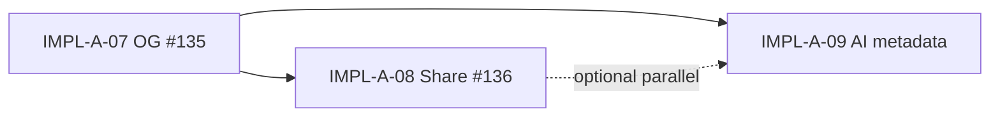

# IMPL-A-09 AI / agent discoverability metadata (plan)

> **Epic:** [FEAT-A-03 #117](https://github.com/gnosis-box/THP-for-Good/issues/117) (marketing discoverability)  
> **Builds on:** [IMPL-A-07 #135](https://github.com/gnosis-box/THP-for-Good/issues/135) — OG/Twitter (`lib/site-metadata.ts`, PR #139)  
> **Suggested branch:** `impl/a-09-ai-agent-metadata`  
> **Suggested issue:** create `IMPL-A-09` after PR #139 merge (or stack on same review stream if preferred)

## Goal

Make THP for Good easier to **understand and cite** for AI assistants, link fetchers, and search engines — without duplicating OG work or opening unrestricted training crawlers by default.

## What is already done (do not redo)

| Layer | Status |
|-------|--------|
| Open Graph + Twitter on `/` and `/expert/[id]` | Done (#135 / PR #139) |
| `metadataBase`, `NEXT_PUBLIC_APP_URL`, default OG image | Done (`lib/site-metadata.ts`) |
| Home hero copy aligned with metadata | Done (#134) |
| Expert share button (Web Share API) | Pending (#136 IMPL-A-08) |

## Scope (v1 — pragmatic)

### 1) `llms.txt` (machine-readable site guide)

Static route **`/llms.txt`** (App Router `app/llms.txt/route.ts` or `public/llms.txt`).

Content (English, concise):

- What THP for Good is (1–2 sentences, aligned with hero copy)
- Primary user actions: find expert, book in CRC, offer expertise, donate
- Key URLs: `/`, `/about`, `/stats`, `/expert/register`, example expert path pattern
- Circles / CRC context in one line (link to `/about`)
- **Out of scope for llms.txt:** secrets, admin routes, wallet internals

Reuse copy from `UI_COPY.home.hero` and `/about` themes — no long duplicate of `/about`.

### 2) `robots.txt` + AI crawler policy (explicit decision)

Add **`app/robots.ts`** (Next.js Metadata API) or static `public/robots.txt`.

**Default recommendation (v1):**

- Allow normal indexing of public marketing pages (`/`, `/about`, `/stats`, `/expert/*` active profiles)
- **Disallow** `/admin`, `/api`, internal tooling paths
- For AI training bots (`GPTBot`, `ClaudeBot`, `Google-Extended`, etc.): **allow** (same public routes as `*`; only `/admin` and `/api` disallowed)

Document the policy in this spec § Decision log — one line in PR description.

### 3) JSON-LD structured data (schema.org)

Server-rendered `<script type="application/ld+json">` on key pages only.

| Route | Schema | Source |
|-------|--------|--------|
| `/` | `WebSite` + `Organization` | `lib/site-metadata.ts` constants + hero copy |
| `/expert/[id]` | `ProfilePage` + `Person` (name, description, url) | `getExpertById` — same guards as `generateMetadata` |
| `/about` | optional `AboutPage` / `Organization` | static copy (minimal v1) |

**Out of v1:** `Event`, `Offer`, per-session Cal.com slots, on-chain treasury amounts in JSON-LD.

Implementation: small helper `lib/structured-data.ts` + component `components/seo/JsonLd.tsx` (or inline in layouts/pages).

### 4) Dynamic sitemap

**`app/sitemap.ts`** (Next.js convention):

- `/`, `/about`, `/stats`, `/expert/register`, `/dao`, … (static public routes)
- `/expert/[id]` for **active** experts only (`getAllExperts({ includeInactive: false })`)
- Absolute URLs via existing `getAppOrigin()` from `lib/site-metadata.ts`

### 5) Wire-up with existing metadata module

Extend **`lib/site-metadata.ts`** (or sibling `lib/structured-data.ts`) so:

- Single source for `SITE_NAME`, origin, default description
- No drift between OG description and JSON-LD / llms.txt summaries

## Out of scope (v1)

- `ai.txt` (non-standard; skip unless required later)
- Paid ads / Umami campaigns
- i18n alternate locales
- Per-expert OG images from Circles avatars
- Marketplace listing ([#110](https://github.com/gnosis-box/THP-for-Good/issues/110))
- MCP server or OpenAI plugin manifest for THP app
- Blocking or allowing crawlers at CDN/Cloudflare layer (infra follow-up)

## Files to add / change

| File | Action |
|------|--------|
| `app/llms.txt/route.ts` or `public/llms.txt` | Add llms guide |
| `app/robots.ts` | Crawler policy |
| `app/sitemap.ts` | Dynamic sitemap |
| `lib/structured-data.ts` | JSON-LD builders (new) |
| `components/seo/JsonLd.tsx` | Safe JSON-LD render (new, optional) |
| `app/page.tsx` | Inject home JSON-LD |
| `app/expert/[id]/page.tsx` | Inject expert JSON-LD (valid experts only) |
| `app/about/page.tsx` | Optional org JSON-LD |
| `lib/site-metadata.ts` | Export shared copy constants if needed |
| `spec/landing-marketing-ux.md` | Add §4 reference to this plan (after issue created) |
| `AGENTS.md` | Row IMPL-A-09 when issue exists |

## Implementation steps

1. **Policy lock** — Confirm robots rules for AI training bots (**allow** v1 — product decision).
2. **llms.txt** — Ship static guide with canonical URLs from `getAppOrigin()`.
3. **robots.ts** — Public allowlist + disallow admin/api; reference sitemap URL.
4. **sitemap.ts** — Static routes + active experts; verify URL count reasonable.
5. **JSON-LD** — Home + expert pages; skip invalid/missing expert IDs.
6. **Verification** — Build + curl checks (see checklist).

## Verification checklist

- [ ] `pnpm build` passes
- [ ] `GET /llms.txt` returns 200, plain text, correct absolute links
- [ ] `GET /robots.txt` (via robots.ts) lists sitemap and disallows `/admin`, `/api`
- [ ] `GET /sitemap.xml` includes `/` and active `/expert/{id}` entries
- [ ] `/` HTML contains valid JSON-LD (`WebSite` / `Organization`)
- [ ] `/expert/1` HTML contains `Person` / `ProfilePage` JSON-LD
- [ ] `/expert/999999` — no expert-specific JSON-LD; 404 behavior unchanged
- [ ] No regression on OG tags from IMPL-A-07 (spot-check `og:title` on `/`)
- [ ] Google Rich Results Test or schema validator on staging/prod URL (manual)

## Execution order (relative to epic #117)

**Recommendation:** start IMPL-A-09 **after PR #139 merge** (OG baseline on `dev`), in parallel with or right after IMPL-A-08.

## Decision log (defaults — change before impl if needed)

| Topic | Default |
|-------|---------|
| AI training crawlers | **Allow** in robots v1 (public pages only; `/admin`, `/api` still disallowed) |
| llms.txt format | Plain markdown-like text, English |
| JSON-LD depth | Minimal Person + WebSite only |
| Sitemap | Active experts only |
| Copy source | Reuse `UI_COPY` + site-metadata constants |

## Delivery

- Branch: `impl/a-09-ai-agent-metadata` from updated `dev`
- PR linked to new `IMPL-A-09` issue + note on #117 epic
- Do not close #117 until A-08 + A-09 (+ marketplace #110 if ever) are triaged
