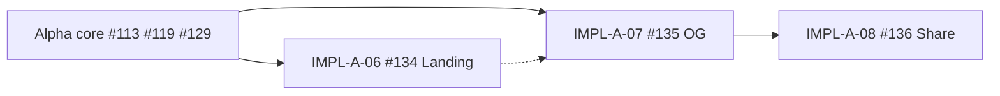

# Landing hero & marketing discoverability (Alpha growth)

> **Tracking:** [FEAT-A-02 #114](https://github.com/gnosis-box/THP-for-Good/issues/114) · [FEAT-A-03 #117](https://github.com/gnosis-box/THP-for-Good/issues/117)  
> **Implementation (post–alpha core):** [IMPL-A-06 #134](https://github.com/gnosis-box/THP-for-Good/issues/134) · [IMPL-A-07 #135](https://github.com/gnosis-box/THP-for-Good/issues/135) · [IMPL-A-08 #136](https://github.com/gnosis-box/THP-for-Good/issues/136)

P3 growth work — scheduled **after** alpha core (donate CTA #113, step gating #119, invitation pool #129).

---

## 1. Landing hero (FEAT-A-02 → IMPL-A-06)

| Decision | Choice |
|----------|--------|
| Route | Hero section on **`/`** above [`ExpertBrowser`](../components/experts/ExpertBrowser.tsx) — no `/welcome` |
| Copy | New strings in [`lib/ui-copy.ts`](../lib/ui-copy.ts); shorten `/about` themes, do not replace `/about` |
| Patterns | [`PageHeader`](../components/layout/PageHeader.tsx), [`MetricsPanel`](../components/ui-patterns/metrics-panel.tsx), [`AboutHero`](../components/about/AboutSections.tsx) — see [`spec/motion-design-audit.md`](motion-design-audit.md) |
| CTAs | Scroll/focus experts · `/expert/register` · `/about` · `/about#donate` |

**Branch:** `impl/a-06-home-landing-hero`

---

## 2. Open Graph metadata (FEAT-A-03 → IMPL-A-07)

| Page | Metadata source |
|------|-----------------|
| `/` | Static + aligned with home hero / `UI_COPY.home` after #134 |
| `/expert/[id]` | `generateMetadata` from DB expert (name, bio excerpt, skills) |

- Default OG image: brand asset in `public/` or `app/opengraph-image`
- Absolute URLs: `NEXT_PUBLIC_APP_URL` or documented production host
- Root [`app/layout.tsx`](../app/layout.tsx) remains fallback

**Branch:** `impl/a-07-og-metadata`

---

## 3. Expert share button (FEAT-A-03 → IMPL-A-08)

- Control on [`ExpertDetail`](../components/experts/ExpertDetail.tsx) hero
- `navigator.share` when available; else clipboard + toast
- English only; iframe-safe fallback

**Branch:** `impl/a-08-expert-share`  
**Recommended after** #135 for rich link previews.

---

## 4. Execution order

---

## 5. Out of scope (epic #117 remainder)

- Paid ads
- i18n FR ([DIV-L3-03](../AGENTS.md))
- Umami campaign setup — [`spec/analytics-strategy.md`](analytics-strategy.md)
- Circles marketplace PR — [#110](https://github.com/gnosis-box/THP-for-Good/issues/110) (verify separately)

---

## 6. Verification (per IMPL)

| IMPL | Checks |
|------|--------|
| #134 | `/` hero + CTAs on mobile/desktop; lint + build |
| #135 | OG tags on `/` and `/expert/[id]`; 404 expert |
| #136 | Share/copy on mobile + desktop |
