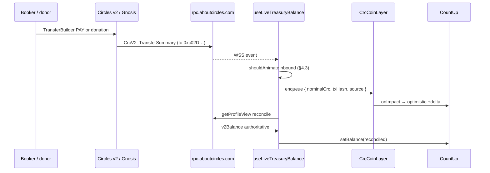

# Live CRC treasury counter — research & implementation spec

> **Issue:** [IMPL-L4-08 #87](https://github.com/gnosis-box/THP-for-Good/issues/87)  
> **Status:** Implemented — PR [#91](https://github.com/gnosis-box/THP-for-Good/pull/91) → `dev` (spec merged in [#88](https://github.com/gnosis-box/THP-for-Good/pull/88))  
> **Treasury org:** `THP For Good DAO` — `0xc02D5aaCA64dE428D571dA42538232C431E0CDeD`  
> **Balance probe (2026-05-24):** **15,857.30 CRC** — snapshot at research time; live UI uses `getProfileView` reconcile

Cross-refs: [`useful-links.md`](useful-links.md) § On-chain / Circles ecosystem · [`analytics-strategy.md`](analytics-strategy.md) §2 · [`crc-pay.ts`](../lib/crc-pay.ts)

---

## 1. Problem & shipped behaviour

**Before (v0):** treasury balance fetched once on page load (`GET /api/stats`, single `getProfileView` on `/about`).

**Now (v1 — PR #91):**

| Surface | Behaviour | Key files |
|---------|-----------|-----------|
| `/about` | Live goal % + CRC raised; WSS + local donate coin from button | `DonationSection.tsx`, `LiveTreasuryCounter` |
| `/stats` | Live treasury hero; WSS only when panel visible (`IntersectionObserver`) | `LiveTreasuryMetricsPanel.tsx`, `StatsDashboard.tsx` |
| `/expert/[id]` | Post-PAY coin from Pay button + compact treasury leg chip | `PayButton.tsx`, `PayTreasuryFeedback.tsx` |
| Global | Pending tx dedupe, WSS reconnect, 30 s poll fallback | `TreasuryProviders`, `use-live-treasury-balance.ts` |

When the on-chain balance changes, the UI:

1. Detects via WebSocket `circles_subscribe` (+ polling fallback).
2. Animates one **CRC coin** per inbound `TransferSummary` (§2).
3. Bumps the counter on coin impact, then reconciles with `getProfileView.v2Balance`.

---

## 2. What is “the coin”? (CRC ontology)

There is **no on-chain coin object**. CRC is a **demurraged mutual-credit balance** on Circles v2 (Gnosis Chain, id `100`):

| Concept | Meaning |
|---------|---------|
| **Avatar** | Every participant (human, group, org) has an address. Treasury is a **`CrcV2_RegisterOrganization`** avatar named **“THP For Good DAO”**. |
| **Personal / group tokens** | Transfers route through the **trust graph** and often touch the **THP group token** `0x2b5E4045936ef12250a8c01e4Cbf71E9bEE69e00` as an intermediate hop — not a second payment. |
| **Treasury sink** | **`FOUNDATION_ADDRESS`** `0xc02D…` — org that receives PAY treasury legs and donations ([`crc-pay.ts`](../lib/crc-pay.ts)). **Not** the group address `0x2b5E…` ([`useful-links.md`](useful-links.md) § On-chain). |
| **Displayed balance** | `getProfileView(address).v2Balance` — TimeCircles-adjusted total (same as `circlesV2_getTotalBalance(..., true)`). |
| **UI “coin”** | A **motion particle** representing one **inbound treasury credit** (`CrcV2_TransferSummary` — §4). It is not minted, not an ERC-20, not a literal token flying on-chain. |

**Implication:** Animation triggers on **indexed Circles events**, not on wallet `Transfer` logs alone. Balance drift from **demurrage** (~7%/year on v2) requires periodic **`getProfileView` reconcile** — event sums will not match `v2Balance` over time.

---

## 3. Where treasury CRC comes from (validated sources)

On-chain probe: `circles_getTransactionHistory` + `circles_events_paginated` on `0xc02D…` (43 txs, 42 inbound, 1 outbound dust). Explorer UI may show **0 rows** for high `startBlock` filters — prefer **Circles RPC** ([`useful-links.md`](useful-links.md) § Explorer — avatar events).

### 3.1 Inflow categories

| Source | How it reaches treasury | App code | Typical sender |
|--------|-------------------------|----------|----------------|
| **A — Donation** | `TransferBuilder` → direct transfer to `FOUNDATION_ADDRESS` | [`buildDonationTransactions`](../lib/crc-pay.ts) · [`DonationSection`](../components/about/DonationSection.tsx) | Any connected booker |
| **B — Booking PAY (treasury leg)** | Split PAY: `foundationWei` to `FOUNDATION_ADDRESS`, expert leg to expert avatar | [`buildSplitPayTransactions`](../lib/crc-pay.ts) · [`PayButton`](../components/experts/PayButton.tsx) | Session booker |
| **C — External / manual** | Circles app or third-party transfer via trust path | — | Any trusted avatar |
| **D — Seed / ops / demo** | Historical test transfers during hackathon & seed wallets | [`scripts/seed.ts`](../scripts/seed.ts) · [`spec/seed.md`](seed.md) | e.g. seed expert **Zet** `0x3D0987DB…`, admins `0x7C40…`, `0xa3bA…` |

**Largest historical inbound:** ~15,350 nominal circles (~7,479 CRC TimeCircles) from `0x3D0987DB…` (seed expert) — initial treasury funding, not an app user flow.

**Recent inbound examples (May 2026):**

| From (short) | Nominal (wei→CRC) | `crc` field (TimeCircles) | Likely source |
|--------------|-------------------|---------------------------|---------------|
| `0x8406c317…` (Ludarep) | 10 | 4.87 | Donation or test PAY |
| `0x7c40dca0…` | 10 | 4.87 | Seed admin wallet |
| `0x7f5aa1ea…` | 0.25 – 2.08 | 0.12 – 1.02 | Small donation / test |
| `0xc536a775…` | 10 | 4.87 | Community tester |

**Outbound (rare):** one dust outbound to `0x000…000` in same tx as inbound (internal Circles accounting) — **do not** treat as user-facing withdrawal.

### 3.2 Group vs org (do not confuse)

| Address | Role | Receives app PAY? |
|---------|------|-------------------|
| `0x2b5E4045936ef12250a8c01e4Cbf71E9bEE69e00` | THP **Circles group** — membership, Promote | **No** (PRD legacy name “foundation”) |
| `0xc02D5aaCA64dE428D571dA42538232C431E0CDeD` | THP **organization** — treasury sink | **Yes** |

Internal events show `CrcV2_TransferSingle` **from** `0x2b5E…` **to** treasury — that is **path routing**, not a separate user payment (§4.2).

---

## 4. How to treat on-chain events (validated filter rules)

### 4.1 RPC methods (probed 2026-05-24)

| Method | Purpose | Notes |
|--------|---------|-------|
| `circles_getProfileView` | Authoritative **`v2Balance`** | Already used in app |
| `circlesV2_getTotalBalance(addr, true)` | Same total as string | Simpler when only balance needed |
| `circles_getTransactionHistory` | Human-readable inbound/outbound list | Fields: `from`, `to`, `circles`, `crc`, `value`, `transactionHash` |
| `circles_getTransactionHistoryEnriched` | History + **sender/receiver profiles** (names, avatars) | Use for “from Ludarep” tooltips |
| `circles_events_paginated` | Raw event stream for subscription design | Returns `event` + `values` |
| `rpc.discover` | OpenRPC schema | Documents WebSocket below |

**WebSocket (from `rpc.discover`):**

```
WSS  wss://rpc.aboutcircles.com/ws/subscribe

{"jsonrpc":"2.0","method":"circles_subscribe","params":["circles", {"address": "0xc02D5aaCA64dE428D571dA42538232C431E0CDeD"}]}
```

Docs also describe SDK `CirclesData.subscribeToEvents` — same indexer ([Circles docs — avatar events](https://docs.aboutcircles.com/querying-circles-profiles-and-data/subscribing-to-avatar-events)).

### 4.2 Event types on treasury (last 100 events — frequency)

| Event type | Count | Treat for live coin? |
|------------|-------|----------------------|
| `CrcV2_FlowEdgesScopeSingleStarted` | 44 | **Ignore** — flow setup |
| `CrcV2_FlowEdgesScopeLastEnded` | 10 | **Ignore** — flow teardown |
| `CrcV2_TransferSingle` | 18 | **Ignore** if `from === GROUP_ADDRESS` (internal hop) |
| `CrcV2_TransferSummary` | 15 | **Trigger** — canonical inbound amount (§4.3) |
| `CrcV2_StreamCompleted` | 11 | **Dedupe** — same tx as Summary; do not double-count |
| `CrcV2_DiscountCost` | 2 | **Ignore** — protocol fee metadata |

### 4.3 Trigger rule (recommended)

Fire **one coin + one balance reconcile** per transaction when **all** match:

```typescript
const GROUP = '0x2b5e4045936ef12250a8c01e4cbf71e9bee69e00';
const TREASURY = '0xc02d5aaca64de428d571da42538232c431e0cded';

function shouldAnimateInbound(event: CirclesEvent): boolean {
  if (event.event !== 'CrcV2_TransferSummary') return false;
  const { from, to, transactionHash } = event.values;
  if (to?.toLowerCase() !== TREASURY) return false;
  if (from?.toLowerCase() === GROUP) return false; // internal group hop
  if (seenTx.has(transactionHash)) return false;
  return true;
}
```

**Amount for coin label (user-facing):**

```typescript
// values.amount is wei (hex or decimal string)
const nominalCrc = Number(BigInt(amountWei)) / 1e18;
```

Use **`nominalCrc`** on the flying coin (matches “10 CRC” donation presets). Use **`getProfileView` delta** for the counter total — not the sum of event `crc` fields (demurrage-adjusted per-leg values ≠ wallet total).

**After animation:** debounced `getProfileView` → set display to `v2Balance` (authoritative).

### 4.4 Same-tab dedupe

| Case | Handling |
|------|----------|
| User donates in `/about` | Optimistic bump + pending `txHash`; ignore WS event with same hash |
| User pays on `/expert/[id]` | Same pattern via `PayButton` |
| External transfer | WS event only |

### 4.5 Demurrage & negative drift

`v2Balance` can **decrease without a visible outbound TransferSummary** (demurrage decay). **No red coin** for passive decay in v1 — counter adjusts on reconcile.

| Mitigation | Spec target | v1 shipped (#91) |
|------------|-------------|------------------|
| Reconcile after each inbound | Yes | Yes (debounced 300 ms) |
| Reconcile on tab focus | Yes | Yes (`visibilitychange`) |
| Periodic reconcile 60–120 s | Recommended | **Deferred** — poll 30 s only when WSS disconnected |
| Backfill on WSS reconnect | §5 #4 | **Deferred** — reconnect only, no `getTransactionHistory` backfill |

---

## 5. Live data strategy (updated)

| Priority | Mechanism | When |
|----------|-----------|------|
| **1** | WebSocket `circles_subscribe` on `FOUNDATION_ADDRESS` | Primary — filter `CrcV2_TransferSummary` (§4.3) |
| **2** | `getProfileView` reconcile | After each trigger + periodic backstop |
| **3** | Polling `getProfileView` every 30 s (pause if `document.hidden`) | Fallback if WSS blocked in iframe |
| **4** | `circles_getTransactionHistory` on reconnect | Backfill missed txs since last block — **deferred post-v1** |

**Not recommended for v1:** raw Gnosis `eth_subscribe` log filtering — CRC v2 paths span Hub + group token + streams; Circles indexer already normalizes this ([`analytics-strategy.md`](analytics-strategy.md) §4.1).

**v1 note:** polling runs every 30 s when WSS is down (skips when connected and when `document.hidden`).

---

## 6. Animation — coin flight (UI metaphor)

The coin **represents** the inbound `TransferSummary`, not an on-chain asset.

### 6.1 Spawn origin (decision D1 — resolved)

| Source class | Spawn position |
|--------------|----------------|
| **Local donation / PAY** (known pending tx) | From triggering button (`Donate`, `Pay … CRC`) |
| **External / WS-only** | Top-right viewport edge (fixed portal) |
| **`prefers-reduced-motion`** | No flight — instant counter bump |

Optional P2: tooltip with sender name from `getTransactionHistoryEnriched` (“+10 CRC from Ludarep”).

### 6.2 Motion stack

| Layer | Choice |
|-------|--------|
| Flight | Motion portal particles (`motion@^12`) — [`motion-design-audit.md`](motion-design-audit.md) |
| Counter | Existing [`CountUp`](../components/motion/count-up.tsx) |
| Cap | Max **3** concurrent coins (`use-coin-burst-queue.ts`); merge bursts within 2 s — **partial** (cap only, no amount merge yet) |

Refs: [Motion layout animations](https://motion.dev/docs/react-layout-animations) · [coin celebration pattern](https://hoainho.info/blog/creating-a-coin-celebration-effect-with-react)

### 6.3 Decisions closed

| ID | Decision |
|----|----------|
| D1 | Local tx → button spawn; external → top-right |
| D2 | No animation for outbound / demurrage decay in v1 |
| D3 | Subscribe when treasury panel visible (`IntersectionObserver`) on `/stats`; always on in `/about` donation block |
| D4 | Lucide `Coins` + `--accent` pill styling (matches CRC price tokens — [`design-tokens.md`](design-tokens.md)) |

---

## 7. Architecture



### 7.1 Modules (PR #91)

| Module | Responsibility |
|--------|----------------|
| `lib/treasury-events.ts` | Parse `TransferSummary`, filter group hops |
| `lib/treasury-ws.ts` | WSS client + reconnect backoff |
| `lib/treasury-coin-events.ts` | Local donate coin dispatch (`thp:treasury-local`) |
| `lib/treasury-coin-demo.ts` | Dev spawn helpers + demo tx detection |
| `lib/analytics-rpc.ts` | `fetchTreasuryBalanceCrc()` |
| `contexts/TreasuryPendingTxContext.tsx` | Same-tab pending tx registry |
| `hooks/use-live-treasury-balance.ts` | WSS + polling fallback + reconcile |
| `hooks/use-coin-burst-queue.ts` | Coin queue (max 3 concurrent) |
| `components/motion/crc-coin-flight.tsx` | Portal particle layer |
| `components/motion/live-treasury-counter.tsx` | CountUp + coin layer (balance / goal modes) |
| `components/motion/pay-treasury-feedback.tsx` | Post-PAY treasury leg chip |
| `components/stats/LiveTreasuryMetricsPanel.tsx` | Stats treasury panel + IntersectionObserver |
| `components/treasury/TreasuryProviders.tsx` | App-wide provider shell |
| `scripts/probe-treasury-ws.mjs` | Node WSS smoke test |

### 7.2 Integration points

| Page | Component |
|------|-----------|
| `app/layout.tsx` | `TreasuryProviders` |
| `/about` | `DonationSection` → `LiveTreasuryCounter` (goal mode) |
| `/stats` | `StatsDashboard` → `LiveTreasuryMetricsPanel` |
| `/expert/[id]` | `PayButton` + global `PayTreasuryFeedback` |

---

## 8. Validation checklist (done)

- [x] Live balance: **15,857.30 CRC** via `circles_getProfileView` / `circlesV2_getTotalBalance`
- [x] Avatar type: `CrcV2_RegisterOrganization` — “THP For Good DAO”
- [x] Inflow trigger: **`CrcV2_TransferSummary`** to treasury, exclude group internal hops
- [x] Ignore flow scaffolding events (`FlowEdgesScope*`)
- [x] WebSocket endpoint documented in OpenRPC (`/ws/subscribe`)
- [x] Seed/demo senders mapped to [`spec/seed.md`](seed.md)
- [x] Group `0x2b5E…` vs org `0xc02D…` clarified per [`useful-links.md`](useful-links.md)

### 8.1 Implementation acceptance (#87 / PR #91)

- [x] `/about` — live goal % + raised CRC; local donate coin; WSS external inflow
- [x] `/stats` — live treasury hero; WSS when panel visible (IntersectionObserver)
- [x] `/expert/[id]` — post-PAY coin + treasury leg chip
- [x] 1 tx = 1 labeled coin (`+X CRC`); reduced motion = instant bump
- [x] WSS reconnect + 30 s polling fallback; same-tab dedupe via pending tx registry
- [x] `pnpm build` passes
- [ ] One live donation end-to-end in Circles playground iframe (manual QA before merge)

### 8.2 Research spike (pre-impl)

- [x] Confirm WSS from browser (`wss://rpc.aboutcircles.com/ws/subscribe` → HTTP 101)
- [x] Prototype single coin flight + reconcile loop

### 8.3 Manual testing & dev tools (no on-chain tx)

The floating **Treasury coin demo** panel is **disabled by default** (`TREASURY_COIN_DEV_PANEL_ENABLED = false`). In development, [`TreasuryCoinDevController`](../components/treasury/TreasuryCoinDevController.tsx) still mounts (no UI) and handles **URL auto-fire** + **`window.__THP_TREASURY_DEMO__`**. Re-enable the panel only for extended UI tuning.

#### URL query (auto-fire once on load)

| URL | Effect |
|-----|--------|
| `/about?demo-coin=10&demo-from=external` | External inflow → cagnote (top-right spawn) |
| `/about?demo-coin=25&demo-from=button` | Donate-button spawn → cagnote |
| `/expert/[id]?demo-coin=8&demo-from=pay` | Pay treasury leg → bottom chip |

Aliases: `demo-treasury`, `demo-spawn` (same as `demo-from`).

#### Browser console (development only)

Register the panel temporarily (`TREASURY_COIN_DEV_PANEL_ENABLED = true`) **or** use the global API (always available in `pnpm dev` via `TreasuryCoinDevController`):

```javascript
window.dispatchEvent(new CustomEvent('thp:treasury-local', {
  detail: {
    txHash: '0xlocal' + Date.now().toString(16),
    nominalCrc: 10,
    spawnRect: { x: 400, y: 600, width: 140, height: 40 }, // optional; omit for external spawn
  },
}));
```

With the dev panel enabled:

```javascript
__THP_TREASURY_DEMO__.fireInbound({ nominalCrc: 10, spawn: 'external' });
__THP_TREASURY_DEMO__.fireDonate(25);
__THP_TREASURY_DEMO__.firePay(8);  // best on /expert/[id] with Pay drawer open
```

#### Spawn anchors (real buttons)

| `data-*` attribute | Element |
|------------------|---------|
| `data-treasury-donate-btn` | Donate button on `/about` |
| `data-treasury-pay-btn` | Pay button on `/expert/[id]` |

Dev helpers in [`lib/treasury-coin-demo.ts`](../lib/treasury-coin-demo.ts) resolve these when present.

#### WSS probe (Node 22+)

```bash
node scripts/probe-treasury-ws.mjs
```

Logs `CrcV2_TransferSummary` inbound to treasury (Ctrl+C to exit).

#### Animation constants & gotchas

| Item | Value / note |
|------|----------------|
| Flight duration | `COIN_FLIGHT_DURATION_S` = **1.05s** in [`crc-coin-flight.tsx`](../components/motion/crc-coin-flight.tsx) |
| Rule | **1 tx = 1 coin** labeled `+X CRC` |
| Spawn rects | App uses `{ x, y, width, height }` — `rectCenter()` accepts both `SpawnRect` and `DOMRect` |
| Demo tx hashes | Prefix `0xdemo` / `0xlocal` skip RPC reconcile (optimistic bump visible in dev) |
| Reduced motion | No flight; CountUp + progress pulse only |

#### Surfaces

| Page | Coin target | Trigger |
|------|-------------|---------|
| `/about` | Cagnote block (`impactTargetRef`: % + bar + CRC raised) | Donate success, WSS external, demo |
| `/stats` | Treasury balance hero | WSS when panel visible (IntersectionObserver) |
| `/expert/[id]` | Pay treasury chip (bottom) | PAY treasury leg via `PayTreasuryFeedback` |

---

## 9. External references

| Resource | URL |
|----------|-----|
| Treasury org explorer | https://explorer.aboutcircles.com/avatar/0xc02d5aac64de428d571da42538232c431e0cded |
| THP group explorer | https://explorer.aboutcircles.com/avatar/0x2b5e4045936ef12250a8c01e4Cbf71e9bee69e00 |
| Group checker (debug PAY) | https://aboutcircles.github.io/CirclesTools/groupChecker.html |
| Trust path viewer | https://data.aboutcircles.com/path-viewer |
| Circles RPC | https://rpc.aboutcircles.com/ |
| OpenRPC discover | `POST rpc.aboutcircles.com` method `rpc.discover` |
| Avatar event subscriptions | https://docs.aboutcircles.com/querying-circles-profiles-and-data/subscribing-to-avatar-events |
| THP useful-links index | [`spec/useful-links.md`](useful-links.md) |

---

## 10. Skills & workflow

| Order | Skill / doc |
|-------|-------------|
| 1 | **`brainstorming`** — UX edge cases (iframe, reduced motion) |
| 2 | **`thp-for-good-backlog`** — `FEAT-L4-*` + board |
| 3 | [`motion-design-audit.md`](motion-design-audit.md) |
| 4 | **`writing-plans`** after spec approval |
| 5 | **`verification-before-completion`** — WSS + animation proof |

---

## 11. Branch & PR plan

| Branch | PR | Status |
|--------|-----|--------|
| `docs/l4-live-crc-counter` | [#88](https://github.com/gnosis-box/THP-for-Good/pull/88) | Merged → `dev` |
| `impl/l4-live-crc-counter` | [#91](https://github.com/gnosis-box/THP-for-Good/pull/91) | Open → `dev` (closes [#87](https://github.com/gnosis-box/THP-for-Good/issues/87)) |

---

## 12. Summary

- **The “coin”** is a UI particle for an inbound **`CrcV2_TransferSummary`** credit — not an on-chain object.
- **CRC sources:** app **donations**, **booking treasury legs**, **external transfers**, plus historical **seed/demo** wallets (`0x3D0987DB…`, admins).
- **Treat:** animate on **`TransferSummary`** to `0xc02D…`; ignore **group internal hops** and **flow scaffolding** events; **dedupe** by `transactionHash`; **reconcile** display with **`getProfileView.v2Balance`**.
- **Live transport:** **`wss://rpc.aboutcircles.com/ws/subscribe`** + `circles_subscribe`; 30 s polling fallback when WSS down.
- **Deferred post-v1:** periodic demurrage reconcile, WSS reconnect backfill, 2 s burst merge, sender tooltips (P2).
