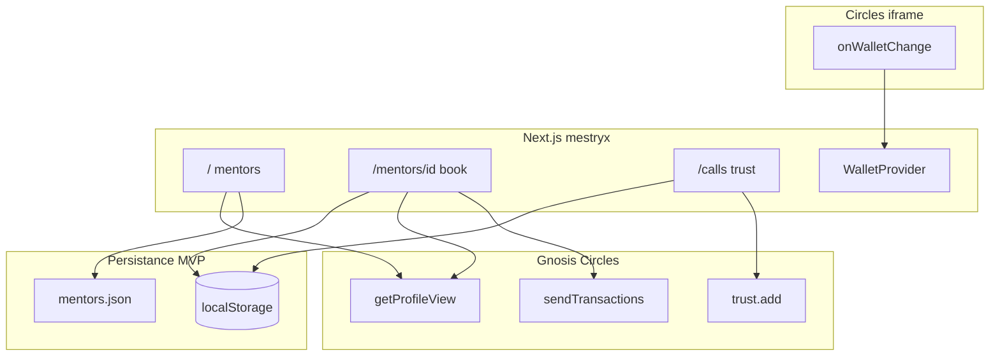

# THP-for-Good — Spécification hackathon (Gnosis / Circles)

| | |
|---|---|
| **Branche** | **`mestryx`** |
| **Remote** | [gnosis-box/THP-for-Good](https://github.com/gnosis-box/THP-for-Good) |
| **Guide code** | [`AGENTS.md`](../AGENTS.md) |
| **Dernière revue** | 2026-05-20 |

> Document de référence produit + technique. Les choix validés sont en **§3** ; la faisabilité est vérifiée contre la stack **déjà présente** en **§5**.

---

## 1. Vision produit

Miniapp **Circles** (iframe Gnosis) pour mettre en relation **students** et **mentors** THP :

1. Découvrir des mentors par **tags** (compétences déclarées, liste ouverte).
2. Réserver un créneau et payer **100 CRC** → **fondation THP-for-Good** (bootcamp).
3. Après l’appel, attester **Trust par tag** sur **Gnosis (Circles)** ; réputation agrégée côté app + `trustStats`.
4. **Post-MVP** : attestations **Intuition** (Trust / NoTrust, mainnet) + agenda mentor + calendriers externes.

```text
Parcourir → (trustStats) → Book + PAY 100 CRC → fondation
         → après call → TRUST [tag] on-chain + index local
```

---

## 2. Stack existante (vérifiée dans le repo)

| Couche | Présent aujourd’hui | Fichiers / paquets |
|--------|---------------------|-------------------|
| Framework | Next.js **16** App Router | `app/`, `next.config.ts` |
| UI | Tailwind **v4**, shadcn (Base UI) | `app/globals.css`, `components/ui/*` |
| Wallet host | `@aboutcircles/miniapp-sdk` **^0.1.30** | `components/wallet/WalletProvider.tsx` — `onWalletChange`, `isMiniappMode` |
| Données Circles | `@aboutcircles/sdk` **^0.1.30** | `components/profile/ProfileLookup.tsx` — `getProfileView`, balances, trust counts |
| Tx host | `sendTransactions` (doc + placeholder) | `app/actions/page.tsx` |
| Iframe CSP | `frame-ancestors` gnosis.io + vercel.app | `next.config.ts` |
| Nav | Dashboard, Profile, Actions | `lib/nav.ts` |

**Absent (à ajouter pour le MVP)** : `data/mentors.json`, routes `/mentors`, `/mentors/[id]`, `/calls`, helpers booking / payment / trust, éventuellement `app/api/notify-booking`.

**Absent (hors dépendances)** : SDK Intuition, Cal.com, push notification API Circles documentée.

---

## 3. Décisions produit (validées)

### 3.1 Rôles & wallet (A)

| Décision | Détail |
|----------|--------|
| **Student-first** | UI orientée student (**A1a**) ; vue mentor **My slots** (**A1b**) seulement si temps |
| **Wallet** | Connexion **uniquement** via host Circles (`onWalletChange`) — pas de MetaMask custom |
| **Login maquette** | = état connecté (`WalletStatus`) ; hors iframe → CTA « Open in Circles » |
| **Paiement** | **100 CRC fixe** → **100 % fondation** (`NEXT_PUBLIC_FOUNDATION_ADDRESS`) |
| **Prix** | `BOOKING_PRICE_CRC = 100` |

### 3.2 Données & UX (B)

| Décision | Détail |
|----------|--------|
| **Mentors** | `data/mentors.json` + enrichissement **`getProfileView`** (avatar, `trustStats`) |
| **Tags** | **Liste ouverte** par mentor ; réputation = trusts communautaires (pas catalogue THP imposé) |
| **Recherche** | Texte libre + match tags / nom / bio (**B7e**, client-side) |
| **Créneaux** | Slots dans JSON ; réservations **`localStorage`** (**B8a**) |
| **Agenda / cal externe** | Post-MVP |

### 3.3 Booking & paiement (C)

| Décision | Détail |
|----------|--------|
| **Timing** | Payer **avant** le call ; pas de book sans tx réussie |
| **Tx** | **`sendTransactions` + calldata transfer CRC** vers fondation (**C10a**) — **spike obligatoire** doc/API Circles |
| **Succès** | Écran avec **GnosisScan** + persistance locale (**C11b**) |
| **Solde** | À la connexion wallet : si `v2Balance` **&lt; 100** → **PAY grisé** (**C12b**) |
| **Annulation** | Politique off-chain (contact THP) |

### 3.4 Trust & réputation (D)

| Décision | Phase |
|----------|--------|
| **Trust par tag** (UI + index app) | MVP |
| **On-chain** | `getAvatar(student).trust.add(mentor)` sur Gnosis |
| **Trustback** | Lecture `trustStats` / profil mentor | MVP (affichage — détail UX **§8**) |
| **NoTrust** | Post-MVP (Intuition) |
| **Intuition** | Après MVP, **mainnet** quand prêt (pas testnet imposé) |

> Circles ne stocke pas un trust natif « par compétence » : le **tag** est porté par l’app (`localStorage` : `{ mentorId, tag, txHash }`) en attendant Intuition.

### 3.5 Notification mentor (N)

| Décision | Détail |
|----------|--------|
| **Objectif** | Informer le mentor après booking payé (**C11**) |
| **Push app Circles** | **Non documenté** dans `miniapp-sdk` — spike parallèle avec gnosis-box |
| **MVP réaliste** | `app/api/notify-booking` → **n8n** ou **Resend** ; fallback **`mailto:`** |
| **Champ JSON** | `notifyEmail` / `notifyWebhook` optionnels par mentor |

---

## 4. Modèle de données

### 4.1 `data/mentors.json`

```json
{
  "mentors": [
    {
      "id": "zet",
      "name": "Zet",
      "walletAddress": "0x…",
      "bio": "CTO @THP, contributor web3 on Intuition",
      "tags": ["AI", "Dev"],
      "notifyEmail": "optional@…",
      "slots": [
        { "id": "zet-1", "label": "Mon 10:00", "available": true }
      ]
    }
  ]
}
```

### 4.2 `localStorage` — `thp-bookings-v1`

```json
{
  "bookings": [{
    "id": "uuid",
    "mentorId": "zet",
    "slotId": "zet-1",
    "studentAddress": "0x…",
    "amountCrc": "100",
    "txHash": "0x…",
    "paidAt": "ISO-8601",
    "status": "booked"
  }]
}
```

### 4.3 `localStorage` — `thp-tag-trust-v1`

```json
{
  "attestations": [{
    "mentorId": "zet",
    "tag": "AI",
    "studentAddress": "0x…",
    "trustTxHash": "0x…",
    "at": "ISO-8601"
  }]
}
```

---

## 5. Matrice de faisabilité (stack actuelle)

Légende : ✅ prêt ou pattern existant · 🟡 à implémenter (faisable) · 🔴 spike / blocage · ⏳ post-MVP

| Fonctionnalité | Statut | Alignement stack | Notes |
|----------------|--------|------------------|-------|
| Wallet injecté host | ✅ | `WalletProvider` + `useWallet` | Pas de bouton Connect (AGENTS.md) |
| Badge adresse / demo mode | ✅ | `WalletStatus`, `isMiniappHost` | |
| Lecture solde CRC | ✅ | `ProfileLookup` → `v2Balance` | Ne pas diviser par 1e18 à l’affichage |
| PAY grisé si &lt; 100 CRC | 🟡 | Même pattern RPC + `useEffect([address])` | Colle **C12b** |
| Liste mentors JSON | 🟡 | Import statique ou fetch `public/data/` | Pas de CMS dans le repo |
| Overlay `trustStats` | 🟡 | Copier logique `ProfileLookup` par `walletAddress` | 1 RPC / mentor au scroll (acceptable MVP) |
| Recherche client | 🟡 | React state + filter | Pas de deps supplémentaires |
| Grille mobile 2×2 | 🟡 | shadcn `Card`, `Badge` | Simplifier `AppShell` / retirer sidebar desktop |
| Page `/mentors/[id]` + slots | 🟡 | Nouvelle route App Router | |
| **`sendTransactions` 100 CRC → fondation** | 🔴 | `miniapp-sdk` + encoder via `@aboutcircles/sdk` | **Risque #1** — spike playground avant P1 |
| Écran succès + GnosisScan | 🟡 | Lien `https://gnosisscan.io/tx/{hash}` | |
| Bookings `localStorage` | 🟡 | Client-only | Prototype mono-navigateur — assumer en démo |
| **`trust.add` mentor** | 🟡 | `getAvatar` écriture + dynamic import | Student doit être avatar Circles enregistré |
| Trust **par tag** (sémantique) | 🟡 | Index `localStorage` + 1× `trust.add` / relation | Transparent jury : tag = couche app |
| Écran `/calls` + choix tag | 🟡 | Nouvelle route | D13–D15 en implémentation |
| API route notif email | 🟡 | Next 16 `app/api/*` | Secret Vercel ; pas dans repo actuellement |
| n8n webhook | 🟡 | `fetch` depuis API route | Infra externe Hermes — compatible |
| Push notification Circles | 🔴 | Non exposé dans SDK listé | Demander à gnosis-box ; ne pas bloquer P0 |
| `signMessage` session | ⏳ | `SignInDemo` existe | **Non requis** pour book/trust MVP |
| Intuition Trust/NoTrust | ⏳ | Pas de package Intuition | Phase P4 |
| Agenda mentor / Cal.com | ⏳ | Backend + OAuth | Après hackathon |
| A1b vue mentor slots | ⏳ | Détection `address ∈ mentors.json` | Si temps |

### Cohérence globale

| Critère | Verdict |
|---------|---------|
| Colle au boilerplate Circles | **Oui** — wallet host, dynamic import SDK, pas de connect custom |
| Colle aux maquettes | **Oui** — grille, search, slots 3×4, PAY 100 CRC, TRUST post-call |
| Scope réaliste 48–72 h | **Oui** si spike C10 jour 1 ; **Non** si C10 non résolu avant P1 |
| Dette assumée | `localStorage`, tags off-chain, notif optionnelle |

---

## 6. Architecture & routes



### Routes cibles (`lib/nav.ts`)

| Route | Rôle | Phase |
|-------|------|-------|
| `/` | Liste mentors + recherche | P0 |
| `/mentors/[id]` | Profil, slots, PAY | P1 |
| `/calls` | Historique + TRUST [tag] | P2 |
| `/profile` | Profil Circles connecté (existant) | P2 optionnel |
| `/my-slots` | Vue mentor | P2b si temps |

Remplacer le dashboard placeholder et ajuster `NAV` (retirer ou masquer sidebar desktop pour mobile-first).

---

## 7. Référence UX (maquettes)

| Écran | Route | Écarts assumés |
|-------|-------|----------------|
| Accueil + search + cartes | `/` | « Login » → wallet status |
| Fiche + slots + PAY | `/mentors/[id]` | PAY désactivé si pas wallet / slot / solde |
| Last calls + TRUST | `/calls` | NO TRUST → post-MVP ; tag picker après call |

Assets session : `assets/image-fe9b936e…` (accueil), `image-359cc526…` (booking), `image-9ffb5bff…` (trust).

---

## 8. Plan d’implémentation

| Phase | Livrable | Bloquant |
|-------|----------|----------|
| **Spike** | Transfer **1 puis 100 CRC** → fondation dans [playground](https://circles.gnosis.io/playground) | **Oui** |
| **P0** | `mentors.json`, shell mobile, grille, B7e, overlay Circles léger | Adresses fondation + mentors |
| **P1** | Booking, PAY grisé C12, succès C11, notif (n8n/Resend ou `mailto:`) | Spike C10 OK |
| **P2** | `/calls`, trust.add + index tag, trustStats sur fiche | — |
| **P2b** | `/my-slots` (A1b) | Optionnel |
| **P3** | Deploy Vercel + rehearsal playground | HTTPS requis |
| **P4** | Intuition mainnet, NoTrust, agenda, cal externe | Post-hackathon |

```text
Jour 1 : Spike C10 + P0
Jour 2 : P1
Jour 3 : P2 + deploy playground
```

### Checklist spike C10

- [ ] Méthode transfer dans `@aboutcircles/sdk` (`.d.ts`)
- [ ] Encodage montant 100 CRC (≠ format affichage `v2Balance`)
- [ ] `sendTransactions([{ to: foundation, data }])` dans playground
- [ ] Hash visible sur GnosisScan

---

## 9. Variables d’environnement

```bash
# .env.example (à compléter)
NEXT_PUBLIC_FOUNDATION_ADDRESS=0x…
NEXT_PUBLIC_BOOKING_PRICE_CRC=100

# Optionnel P1 — notif
RESEND_API_KEY=…
# ou
N8N_NOTIFY_WEBHOOK_URL=…
```

**À fournir par l’équipe** : adresse Safe fondation, wallets mentors réels, emails/webhooks notif.

---

## 10. Hors scope MVP

- Intuition, NoTrust, testnet Intuition
- Paiement direct au mentor on-chain
- Escrow, remboursement auto, smart contract split
- KYC, visio intégrée, marketplace `CirclesMiniapps`
- Push Circles documenté (sauf si spike gnosis-box aboutit)
- SIWE / session backend obligatoire
- Sync multi-appareil des bookings

---

## 11. Questions reportées (non bloquantes)

| ID | Sujet | Quand |
|----|--------|-------|
| N-Q1–Q2 | Emails mentors, n8n vs Resend | Avant P1 notif |
| N-Q3–Q4 | Push Circles host, serveur vs mailto | Spike parallèle |
| N-Q5–Q6 | Notif student, RGPD | Avant prod |
| D13 | Où afficher trustback | P2 UI |
| D14 | Trust seulement après booking payé | P2 logique |
| D15 | Plusieurs tags / un call | P2 logique |
| F | Langue FR/EN, brief jury détaillé | Polish |
| G | Lien All-Aboard monorepo | Post-hackathon |

---

## 12. Journal des décisions

| Date | Décision |
|------|----------|
| 2026-05-20 | Branche `mestryx` · spec consolidée |
| 2026-05-20 | A : A1a, wallet Circles, 100 CRC → fondation, prix fixe |
| 2026-05-20 | B : B5b, tags ouverts, B7e, B8a + agenda/notif plus tard |
| 2026-05-20 | C : C9a, C10a (spike), C11b + notif mentor, C12b PAY grisé |
| 2026-05-20 | D : trust/tag Gnosis MVP · Intuition post-MVP mainnet |
| 2026-05-20 | Revue faisabilité : aligné boilerplate ; C10 + push Circles = spikes |

---

## 13. Commandes

```bash
cd /home/mestryx/WorkSpace/repositories/THP-for-Good
git checkout mestryx
pnpm install
pnpm dev
# Démo réelle :
# https://circles.gnosis.io/playground?url=https://<preview>.vercel.app
```

**Prochaine action code** : spike **C10** → **P0** sur `mestryx`.
