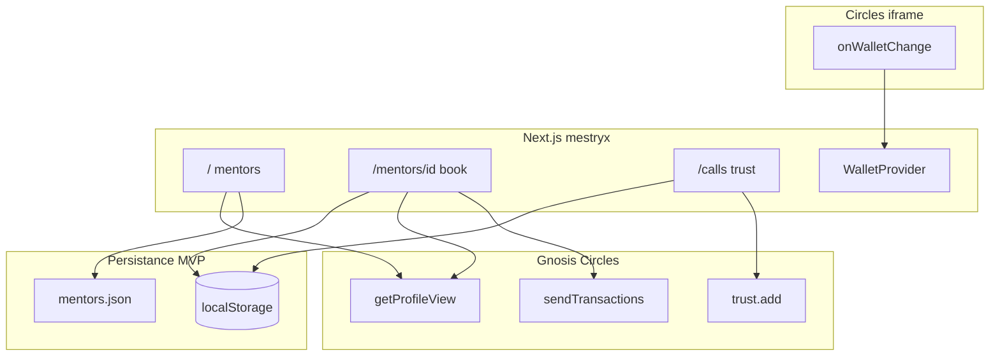

# THP-for-Good — Spécification hackathon (Gnosis / Circles)

| | |
|---|---|
| **Branche** | **`mestryx`** |
| **Remote** | [gnosis-box/THP-for-Good](https://github.com/gnosis-box/THP-for-Good) |
| **Guide code** | [`AGENTS.md`](../AGENTS.md) |
| **Dernière revue** | 2026-05-21 |
| **Commits MVP** | `a6dc292` (MVP + Docker) · `41175b4` (fix pnpm workspace build) |
| **Deploy** | ✅ **Coolify org fonctionnel** (Gnosis apps) |

> Document de référence produit + technique. Les choix validés sont en **§3** ; la faisabilité est vérifiée contre la stack **déjà présente** en **§5**.

---

## 1. Vision produit

Miniapp **Circles** (iframe Gnosis) pour mettre en relation **students** et **mentors** THP :

1. Découvrir des mentors par **tags** (compétences déclarées, liste ouverte).
2. Réserver un créneau et payer **100 CRC** → **fondation THP-for-Good** (bootcamp).
3. Après l’appel, attester **Trust par tag** sur **Gnosis (Circles)** ; réputation agrégée côté app + `trustStats`.
4. **Post-MVP** : attestations **Intuition** (Trust / NoTrust, mainnet) + agenda mentor + calendriers externes.

```text
Parcourir → (trustStats) → Book + PAY 100 CRC → fondation
         → après call → TRUST [tag] on-chain + index local
```

---

## 2. Stack existante (état repo `mestryx` — 2026-05-21)

| Couche | Statut | Fichiers / paquets |
|--------|--------|-------------------|
| Framework | ✅ | Next.js **16** App Router — `app/`, `next.config.ts` (`output: 'standalone'`) |
| UI | ✅ | Tailwind **v4**, shadcn (Base UI) — `app/globals.css`, `components/ui/*` |
| Wallet host | ✅ | `@aboutcircles/miniapp-sdk` **^0.1.30** — `WalletProvider`, `OpenInCirclesHint` |
| Données Circles | ✅ | `@aboutcircles/sdk` — `useCrcBalance`, `useMentorCirclesOverlay`, `lib/crc-transfer.ts`, `lib/trust-transfer.ts` |
| Tx host | ✅ | `sendTransactions` branché dans `MentorDetail` (PAY) et `TrustTagPicker` (TRUST) |
| Iframe CSP | ✅ | `frame-ancestors` gnosis.io + vercel.app + `NEXT_PUBLIC_FRAME_ANCESTOR_ORIGIN` |
| Nav | ✅ | `Mentors` / `My Calls` — `lib/nav.ts` ; sidebar desktop retirée (`AppShell`) |
| Données mentors | ✅ | `data/mentors.json` + `lib/mentors.ts` |
| Persistance MVP | ✅ | `lib/bookings-storage.ts`, `lib/trust-storage.ts` (`localStorage`) |
| Routes MVP | ✅ | `/`, `/mentors/[id]`, `/calls`, `app/api/notify-booking` |
| Deploy | ✅ | Coolify org **Gnosis apps** — Dockerfile, healthcheck OK (`41175b4`) |

**Toujours absent (hors scope MVP ou post-MVP)** : SDK Intuition, Cal.com, push notification API Circles, `/my-slots` (P2b), wallets mentors réels, workflow n8n prod.

**Legacy conservé (non linké dans nav)** : `/profile`, `/actions` (boilerplate).

---

## 3. Décisions produit (validées)

### 3.1 Rôles & wallet (A)

| Décision | Détail |
|----------|--------|
| **Student-first** | UI orientée student (**A1a**) ; vue mentor **My slots** (**A1b**) seulement si temps |
| **Wallet** | Connexion **uniquement** via host Circles (`onWalletChange`) — pas de MetaMask custom |
| **Login maquette** | = état connecté (`WalletStatus`) ; hors iframe → CTA « Open in Circles » |
| **Paiement** | **100 CRC fixe** → **100 % fondation** (`NEXT_PUBLIC_FOUNDATION_ADDRESS`) |
| **Prix** | `BOOKING_PRICE_CRC = 100` |

### 3.2 Données & UX (B)

| Décision | Détail |
|----------|--------|
| **Mentors** | `data/mentors.json` + enrichissement **`getProfileView`** (avatar, `trustStats`) |
| **Tags** | **Liste ouverte** par mentor ; réputation = trusts communautaires (pas catalogue THP imposé) |
| **Recherche** | Texte libre + match tags / nom / bio (**B7e**, client-side) |
| **Créneaux** | Slots dans JSON ; réservations **`localStorage`** (**B8a**) |
| **Agenda / cal externe** | Post-MVP |

### 3.3 Booking & paiement (C)

| Décision | Détail |
|----------|--------|
| **Timing** | Payer **avant** le call ; pas de book sans tx réussie |
| **Tx** | **`sendTransactions` + calldata transfer CRC** vers fondation (**C10a**) — **spike obligatoire** doc/API Circles |
| **Succès** | Écran avec **GnosisScan** + persistance locale (**C11b**) |
| **Solde** | À la connexion wallet : si `v2Balance` **&lt; 100** → **PAY grisé** (**C12b**) |
| **Annulation** | Politique off-chain (contact THP) |

### 3.4 Trust & réputation (D)

| Décision | Phase |
|----------|--------|
| **Trust par tag** (UI + index app) | MVP |
| **On-chain** | `getAvatar(student).trust.add(mentor)` sur Gnosis |
| **Trustback** | Lecture `trustStats` / profil mentor | MVP (affichage — détail UX **§8**) |
| **NoTrust** | Post-MVP (Intuition) |
| **Intuition** | Après MVP, **mainnet** quand prêt (pas testnet imposé) |

> Circles ne stocke pas un trust natif « par compétence » : le **tag** est porté par l’app (`localStorage` : `{ mentorId, tag, txHash }`) en attendant Intuition.

### 3.5 Notification mentor (N)

| Décision | Détail |
|----------|--------|
| **Objectif** | Informer le mentor après booking payé (**C11**) |
| **Push app Circles** | **Non documenté** dans `miniapp-sdk` — spike parallèle avec gnosis-box |
| **MVP réaliste** | `app/api/notify-booking` → **n8n** ou **Resend** ; fallback **`mailto:`** |
| **Champ JSON** | `notifyEmail` / `notifyWebhook` optionnels par mentor |

---

## 4. Modèle de données

### 4.1 `data/mentors.json`

```json
{
  "mentors": [
    {
      "id": "zet",
      "name": "Zet",
      "walletAddress": "0x…",
      "bio": "CTO @THP, contributor web3 on Intuition",
      "tags": ["AI", "Dev"],
      "notifyEmail": "optional@…",
      "slots": [
        { "id": "zet-1", "label": "Mon 10:00", "available": true }
      ]
    }
  ]
}
```

### 4.2 `localStorage` — `thp-bookings-v1`

```json
{
  "bookings": [{
    "id": "uuid",
    "mentorId": "zet",
    "slotId": "zet-1",
    "studentAddress": "0x…",
    "amountCrc": "100",
    "txHash": "0x…",
    "paidAt": "ISO-8601",
    "status": "booked"
  }]
}
```

### 4.3 `localStorage` — `thp-tag-trust-v1`

```json
{
  "attestations": [{
    "mentorId": "zet",
    "tag": "AI",
    "studentAddress": "0x…",
    "trustTxHash": "0x…",
    "at": "ISO-8601"
  }]
}
```

---

## 5. Matrice de faisabilité (état implémentation)

Légende : ✅ fait · 🟡 partiel / à valider en prod · 🔴 non résolu · ⏳ post-MVP

| Fonctionnalité | Statut | Fichiers / notes |
|----------------|--------|------------------|
| Wallet injecté host | ✅ | `WalletProvider` + `useWallet` |
| Badge adresse / demo mode | ✅ | `WalletStatus`, `OpenInCirclesHint`, `isMiniappHost` |
| Lecture solde CRC | ✅ | `hooks/use-crc-balance.ts` |
| PAY grisé si &lt; 100 CRC | ✅ | `MentorDetail` — **C12b** |
| Liste mentors JSON | ✅ | `data/mentors.json`, `MentorGrid`, `MentorCard` |
| Overlay `trustStats` | ✅ | `useMentorCirclesOverlay` sur cartes + fiche |
| Recherche client | ✅ | `MentorSearch` + `filterMentors` — **B7e** |
| Grille mobile 2×2 | ✅ | `MentorGrid` ; sidebar retirée |
| Page `/mentors/[id]` + slots | ✅ | `SlotPicker`, `MentorDetail` |
| **`sendTransactions` 100 CRC → fondation** | 🟡 | `lib/crc-transfer.ts` (capture runner + `transfer.advanced`) — **encodage OK en CLI** ; **tx réelle playground non validée** |
| Écran succès + GnosisScan | ✅ | `BookingSuccess` + `GNOSISSCAN_TX_URL` — **C11b** |
| Bookings `localStorage` | ✅ | `lib/bookings-storage.ts` — clé `thp-bookings-v1` |
| **`trust.add` mentor** | 🟡 | `lib/trust-transfer.ts` + `TrustTagPicker` via `sendTransactions` — **à valider playground** |
| Trust **par tag** (sémantique) | ✅ | `lib/trust-storage.ts` — clé `thp-tag-trust-v1` |
| Écran `/calls` + choix tag | ✅ | `CallList`, `TrustTagPicker` |
| API route notif | ✅ | `app/api/notify-booking/route.ts` |
| n8n webhook | 🟡 | Route prête ; **workflow n8n + secret Coolify non configurés** |
| Push notification Circles | 🔴 | Non exposé SDK — spike gnosis-box non fait |
| Deploy HTTPS (Coolify) | ✅ | App live sur FQDN org — build Docker OK |
| Rehearsal playground E2E | 🟡 | PAY + TRUST + GnosisScan — **non testé en conditions réelles** |
| `signMessage` session | ⏳ | `SignInDemo` existe, non requis MVP |
| Intuition Trust/NoTrust | ⏳ | Phase P4 |
| Agenda mentor / Cal.com | ⏳ | Post-hackathon |
| A1b vue mentor `/my-slots` | ⏳ | Non implémenté (P2b) |

### Cohérence globale

| Critère | Verdict |
|---------|---------|
| Colle au boilerplate Circles | **Oui** |
| Colle aux maquettes | **Oui** (écarts documentés §7) |
| Scope MVP code + deploy | **~95 %** — reste rehearsal playground on-chain + données mentors réelles |
| Dette assumée | `localStorage`, tags off-chain, mentors placeholder, notif optionnelle |

---

## 6. Architecture & routes



### Routes cibles (`lib/nav.ts`)

| Route | Rôle | Phase | Statut |
|-------|------|-------|--------|
| `/` | Liste mentors + recherche | P0 | ✅ |
| `/mentors/[id]` | Profil, slots, PAY | P1 | ✅ |
| `/calls` | Historique + TRUST [tag] | P2 | ✅ |
| `/profile` | Profil Circles connecté (existant) | optionnel | ✅ (legacy, hors nav) |
| `/my-slots` | Vue mentor | P2b | ⏳ non fait |

---

## 7. Référence UX (maquettes)

| Écran | Route | Écarts assumés |
|-------|-------|----------------|
| Accueil + search + cartes | `/` | « Login » → wallet status |
| Fiche + slots + PAY | `/mentors/[id]` | PAY désactivé si pas wallet / slot / solde |
| Last calls + TRUST | `/calls` | NO TRUST → post-MVP ; tag picker après call |

Assets session : `assets/image-fe9b936e…` (accueil), `image-359cc526…` (booking), `image-9ffb5bff…` (trust).

---

## 8. Plan d’implémentation

| Phase | Livrable | Statut | Notes |
|-------|----------|--------|-------|
| **Spike** | Transfer CRC → fondation via playground | 🟡 | Encodage implémenté (`lib/crc-transfer.ts`, `scripts/probe-crc-transfer.mjs`) — **tx réelle non validée** |
| **P0** | `mentors.json`, shell mobile, grille, B7e, overlay | ✅ | Commit `a6dc292` |
| **P1** | Booking, PAY grisé, succès, notif | ✅ | API + fallback `mailto:` ; n8n prod à brancher |
| **P2** | `/calls`, trust.add + index tag, trustStats | ✅ | Trust via `sendTransactions` (pas runner direct) |
| **P2b** | `/my-slots` (A1b) | ⏳ | Optionnel — non fait |
| **P3** | Deploy Coolify + rehearsal playground | 🟡 | **Deploy ✅** ; rehearsal PAY/TRUST playground **restant** |
| **P4** | Intuition, NoTrust, agenda, cal externe | ⏳ | Post-hackathon |

### Checklist spike C10

- [x] Méthode transfer dans `@aboutcircles/sdk` — `avatar.transfer.advanced()` + pathfinder (`CommonAvatar.d.ts`)
- [x] Encodage montant 100 CRC — via SDK (nombre CRC, ≠ `v2Balance` affiché) ; helper `buildCrcPaymentTransactions`
- [ ] `sendTransactions([{ to, data, value }])` **validé dans playground** avec wallet Circles réel
- [ ] Hash visible sur **GnosisScan** après PAY test

### Checklist deploy P3 (Coolify org)

- [x] `Dockerfile` + `.dockerignore` + `output: 'standalone'`
- [x] Fix build Docker (`pnpm-workspace.yaml` → `packages: ['.']`)
- [x] Push branche `mestryx` sur `gnosis-box/THP-for-Good`
- [x] Deploy Coolify **green** (healthcheck `GET /` → 200)
- [x] HTTPS actif sur FQDN org
- [ ] `NEXT_PUBLIC_FRAME_ANCESTOR_ORIGIN` = FQDN HTTPS prod — **à confirmer si iframe Circles OK**
- [ ] Rehearsal : `https://circles.gnosis.io/playground?url=https://<FQDN>/`

### Checklist demo hackathon (§3 Phase 3)

- [x] HTTPS actif sur FQDN org
- [ ] Wallet injecté dans playground
- [ ] PAY 100 CRC → booking `localStorage` + GnosisScan
- [ ] TRUST post-call + tag indexé
- [ ] Notif mentor (n8n ou `mailto:`) testée

---

## 9. Variables d’environnement

```bash
# .env.example (complété — commit a6dc292)
NEXT_PUBLIC_FOUNDATION_ADDRESS=0x2b5E4045936ef12250a8c01e4Cbf71E9bEE69e00
NEXT_PUBLIC_BOOKING_PRICE_CRC=100

# Coolify — CSP iframe (build + runtime)
NEXT_PUBLIC_FRAME_ANCESTOR_ORIGIN=https://<fqdn-coolify-org>

# Runtime only — Coolify secrets (ne pas committer)
N8N_NOTIFY_WEBHOOK_URL=…
# RESEND_API_KEY=…
```

**Encore à fournir par l’équipe** :

- [ ] Wallets Circles **réels** des mentors (remplacer placeholders `0x…0001`–`0004` dans `data/mentors.json`)
- [ ] Emails mentors réels (au lieu de `@example.com`)
- [ ] FQDN Coolify + `NEXT_PUBLIC_FRAME_ANCESTOR_ORIGIN` au **build** (si iframe Circles bloqué)
- [ ] Webhook n8n ou clé Resend en prod

---

## 10. Hors scope MVP

- Intuition, NoTrust, testnet Intuition
- Paiement direct au mentor on-chain
- Escrow, remboursement auto, smart contract split
- KYC, visio intégrée, marketplace `CirclesMiniapps`
- Push Circles documenté (sauf si spike gnosis-box aboutit)
- SIWE / session backend obligatoire
- Sync multi-appareil des bookings

---

## 11. Questions reportées (non bloquantes)

| ID | Sujet | Quand |
|----|--------|-------|
| N-Q1–Q2 | Emails mentors, n8n vs Resend | Avant P1 notif |
| N-Q3–Q4 | Push Circles host, serveur vs mailto | Spike parallèle |
| N-Q5–Q6 | Notif student, RGPD | Avant prod |
| D13 | Où afficher trustback | P2 UI |
| D14 | Trust seulement après booking payé | P2 logique |
| D15 | Plusieurs tags / un call | P2 logique |
| F | Langue FR/EN, brief jury détaillé | Polish |
| G | Lien All-Aboard monorepo | Post-hackathon |

---

## 12. Journal des décisions

| Date | Décision |
|------|----------|
| 2026-05-20 | Branche `mestryx` · spec consolidée |
| 2026-05-20 | A : A1a, wallet Circles, 100 CRC → fondation, prix fixe |
| 2026-05-20 | B : B5b, tags ouverts, B7e, B8a + agenda/notif plus tard |
| 2026-05-20 | C : C9a, C10a (spike), C11b + notif mentor, C12b PAY grisé |
| 2026-05-20 | D : trust/tag Gnosis MVP · Intuition post-MVP mainnet |
| 2026-05-20 | Revue faisabilité : aligné boilerplate ; C10 + push Circles = spikes |
| 2026-05-21 | **Implémentation MVP** P0–P2 sur `mestryx` (`a6dc292`) |
| 2026-05-21 | Deploy **Coolify org** (Dockerfile) — remplace Vercel du plan initial |
| 2026-05-21 | Fix build Docker : `pnpm-workspace.yaml` `packages: ['.']` (`41175b4`) |
| 2026-05-21 | PAY/TRUST via `sendTransactions` + capture runner SDK (miniapp-safe) |
| 2026-05-21 | **Deploy Coolify Gnosis apps fonctionnel** — P3 infra OK |

---

## 13. Commandes

```bash
cd /home/mestryx/WorkSpace/repositories/THP-for-Good
git checkout mestryx
pnpm install          # Node 22 requis
pnpm dev              # http://localhost:3000 — UI seulement hors iframe

pnpm build
node .next/standalone/server.js   # prod local

# Spike encodage CRC (adresse Circles valide requise)
node scripts/probe-crc-transfer.mjs 0x<avatar> 100

# Démo réelle (HTTPS obligatoire)
# Coolify : https://circles.gnosis.io/playground?url=https://<fqdn-coolify>/
# Tunnel local : cloudflared tunnel --url http://localhost:3000
```

**Prochaine action** : **rehearsal playground** Circles (PAY + TRUST + GnosisScan) → remplacer mentors placeholder → n8n notif si besoin.

---

## 14. Avancement détaillé — fait / reste à faire

### ✅ Fait (code livré sur `mestryx`)

| Domaine | Détail |
|---------|--------|
| **Front P0** | `MentorGrid`, `MentorSearch`, `MentorCard`, grille 2×2, hero copy, nav mobile |
| **Front P1** | `MentorDetail`, `SlotPicker`, PAY 100 CRC, `BookingSuccess`, solde grisé |
| **Front P2** | `CallList`, `TrustTagPicker`, trustback (`trustedByCount`) sur fiche |
| **Libs** | `lib/crc-transfer.ts`, `lib/trust-transfer.ts`, `lib/bookings-storage.ts`, `lib/trust-storage.ts`, `lib/config.ts`, `lib/types.ts` |
| **API** | `POST /api/notify-booking` (n8n webhook ou réponse `no_webhook_configured`) |
| **UX Circles** | `OpenInCirclesHint`, dynamic import SDK, pas de bouton Connect |
| **Infra** | `Dockerfile`, `.dockerignore`, `next.config.ts` standalone + CSP extensible |
| **Deploy** | Coolify org **Gnosis apps** — live HTTPS |
| **Données** | `data/mentors.json` (4 mentors placeholder), `.env.example` |

### 🟡 Partiel / à valider

| Item | Bloquant demo ? | Action |
|------|-----------------|--------|
| Rehearsal playground E2E | **Oui** | `playground?url=<FQDN>` — PAY + TRUST |
| `NEXT_PUBLIC_FRAME_ANCESTOR_ORIGIN` | Si iframe blanc | Ajouter FQDN au build + redeploy |
| PAY 100 CRC playground | Oui | Tester avec wallet Circles + CRC ≥ 100 |
| TRUST `trust.add` playground | Oui | Student doit être avatar Circles enregistré |
| GnosisScan hash | Non (preuve demo) | Capturer tx PAY + TRUST pour jury |
| n8n notif prod | Non | Créer workflow + `N8N_NOTIFY_WEBHOOK_URL` Coolify |
| Spike push Circles | Non | Escalade gnosis-box si besoin |

### ⏳ Reste à faire (MVP demo ou post-MVP)

| Item | Priorité | Phase |
|------|----------|-------|
| Wallets + emails mentors réels | **Haute** | Avant demo |
| Rehearsal E2E playground | **Haute** | P3 — **dernière étape avant demo jury** |
| `/my-slots` vue mentor | Basse | P2b |
| Polish FR/EN, copy jury | Basse | Polish |
| PR `CirclesMiniapps` marketplace | Basse | Post-hackathon |
| Intuition, NoTrust, Cal.com | — | P4 |
| D14 explicite « trust seulement si booking payé » | Basse | Implicite via `localStorage` bookings |
| D15 plusieurs tags / un call | Basse | UI actuelle : 1 tag choisi par trust |
